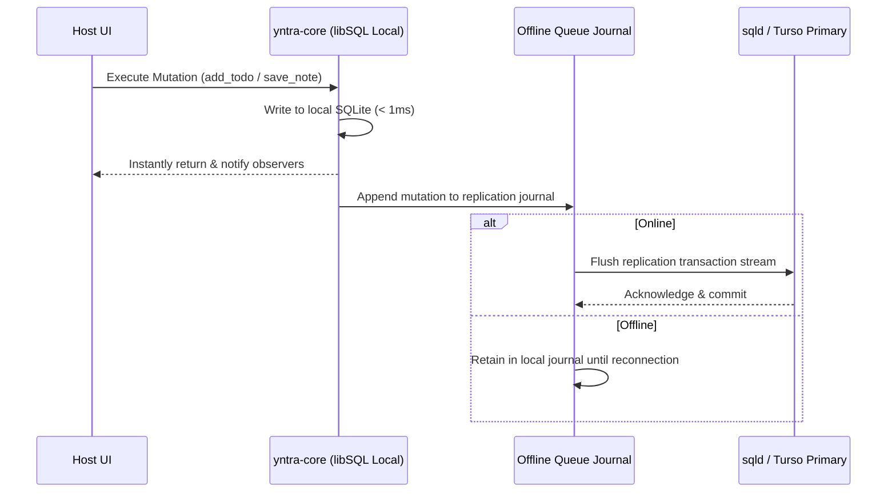

Yntra Platform uses **libSQL embedded replicas** as the single source of truth across all platforms, guaranteeing sub-millisecond local reads and writes regardless of network state.

---

## 1. Replication Architecture

---

## 2. Sync Queue Status Flags

Every table contains a `sync_status` column:
- `pending`: Local modification queued for replication.
- `synced`: Modification successfully acknowledged by primary server.
- `conflict`: Concurrent modification conflict requiring resolution.