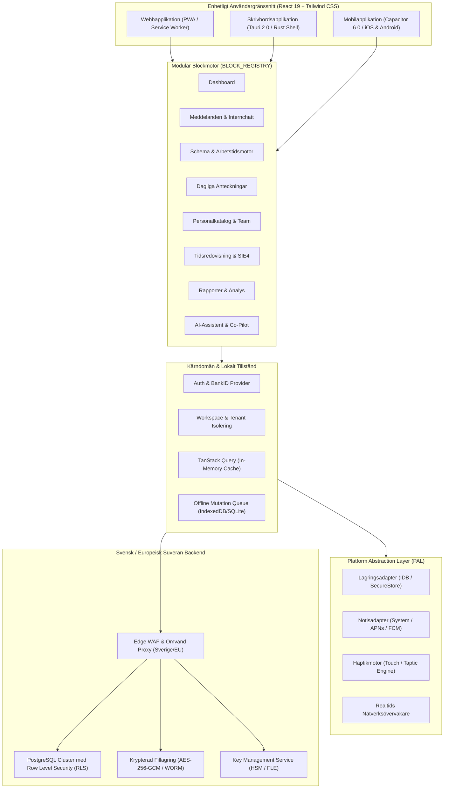
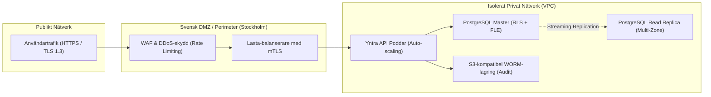

# Yntra Platform: Teknisk Arkitekturspecifikation

Yntra är en **Local-First dynamisk modulär verksamhetsmotor** konstruerad för att möta de högsta kraven på prestanda, skalbarhet och cybersäkerhet i Sverige och Europa.

---

## 1. Högnivåarkitektur (Tripartite Multi-Target)

Yntra bygger på en **enhetlig flerkanalsarkitektur** där en gemensam modern React 19/TypeScript-applikation driver **Webb (PWA)**, **Skrivbord (Tauri/Electron)** och **Mobil (Capacitor)** genom ett dedikerat **Platform Abstraction Layer (PAL)**.



---

## 2. Arkitektoniska Lager

### 2.1 Presentationslager (`src/components/`, `src/features/`)
- **Skandinavisk Designestetik & Ergonomi**: Byggd med Tailwind CSS och tillgängliga Radix UI-primitiver. Strikt följsamhet till *"Inkorg-Standarden"* (`h-12` radhöjd, 3-kolumnsarkitektur, balanserad mikro-ikonografi och förbud mot onödig fetstil).
- **Universell Dialogstandard**: Modaler strukturerade med `rounded-lg`, mörk `bg-black/75` backdrop, `h-12` avgränsat sidhuvud, nedsänkta formulärfält (`bg-background`) och avgränsad sidfotshylla.
- **Högkontrast Obsidian & Zinc Temamotor**: Djup arkitektur (`#0f0f12` kanvas, `#1c1c20` kort, `#27272c` hyllor, `#36363d` linjer) med fullt stöd för dynamiska Tailwind-alfaklasser (`/<alpha-value>`).
- **Adaptiv Responsivitet**: Flytande brytpunkter från mobiler (`<640px`) och surfplattor (`640px-1024px`) till breda skrivbordsmonitorer (`>1440px`).
- **Dynamiska Modul-Brödsmulor**: Automatisk hierarkisk navigering utan redundant "Hem", fullt stöd för svensk/engelsk lokalisering och händelsebaserad nollställning (`yntra:breadcrumb-navigate`).

### 2.2 Modulär Blockmotor (`src/lib/blocks/`)
Istället för monolitiska menyer organiserar Yntra funktionaliteten i självständiga, avgränsade moduler:
- **Deklarativ Registrering**: Varje block registrerar sina rutter, menyikoner, behörigheter och översättningsnycklar i `BLOCK_REGISTRY`.
- **Tenant-Funktionsflaggor**: Organisationer kan dynamiskt aktivera eller inaktivera block per workspace.
- **Rutt- & Säkerhetsvakter**:
  - `RoleGuard`: Stoppar obehöriga roller och omdirigerar användaren baserat på behörighet.
  - `BlockGuard`: Visar en informativ avaktiveringsskärm om modulen är avstängd i det aktuella workspacet.

### 2.3 Platform Abstraction Layer (PAL) (`src/platform/`)
PAL frikopplar hårdvaruspecifika API:er från användargränssnittet:
- **`platform.notifications`**: Inbyggda systemnotiser på Desktop/Mobil, Web Notifications i webbläsaren.
- **`platform.haptics`**: Taktil fysisk återkoppling på iOS/Android, säker no-op på skrivbordet.
- **`platform.storage`**: Abstraherad lokal lagring (IndexedDB, SQLite, krypterad enhetslagring).
- **`platform.network`**: Realtidsdetektering av anslutningsstatus med omedelbara offline-indikatorer.

### 2.4 Local-First Datamotor (`src/lib/`, `src/services/`)
- **Omedelbara Läsningar (<1ms)**: Data levereras direkt från TanStack Query in-memory cache, persisterad till disk.
- **Optimistiska Skrivningar**: Användargränssnittet uppdateras direkt utan att vänta på nätverkssvar.
- **Deterministisk Avstämning**: Tidsstämpelbaserad konfliktlösning (`updated_at`) och automatisk återställning (rollback) vid fel.

---

## 3. Svensk Suverän Molninfrastruktur & Zero-Trust Nätverk

För att garantera 100 % efterlevnad av GDPR, IMY:s föreskrifter och skydd mot utländsk extraterritoriell lagstiftning (US CLOUD Act) driftas Yntra uteslutande i **suveräna svenska och europeiska datacenter**:



### 3.1 Driftsalternativ i Sverige
1. **Svenska Suveräna Moln**:
   - **Safespring** (Stockholm och Göteborg): ISO 27001-certifierade datacenter under svensk jurisdiktion.
   - **Elastx** (Stockholm): Högsäkerhetsdrift med tre redundanta tillgänglighetszoner, anpassat för finansiell och samhällsviktig verksamhet.
   - **Cleura** (Karlskrona/Stockholm): Svensk OpenStack-infrastruktur certifierad för offentlig sektor.
2. **Dedikerad EU-Supabase / PostgreSQL**:
   - Instanser placerade i Frankfurt eller Stockholm med garanterad datalagring inom EU/EES och strikta DPA/PUB-avtal.

### 3.2 Fältskryptering & Nyckelhantering (FLE / KMS)
- Känsliga uppgifter (svenska personnummer, medicinska anteckningar, bankuppgifter) krypteras med **Envelope Encryption**:
  - Varje datapost krypteras med en unik datanyckel (DEK, AES-256-GCM).
  - DEK krypteras i sin tur med tenantens huvudnyckel (KEK) som hanteras i en HSM (Hardware Security Module).
  - Även om databasen skulle läckas i sin helhet förblir fälten oläsbara utan HSM-auktorisering.

---

## 4. Hög Tillgänglighet (HA) & Katastrofåterställning (DR)

| Parameter | Specifikation | Beskrivning |
| :--- | :--- | :--- |
| **RPO (Recovery Point Objective)** | **< 5 minuter** | Kontinuerlig WAL-arkivering (Write-Ahead Logging) och point-in-time recovery (PITR). |
| **RTO (Recovery Time Objective)** | **< 15 minuter** | Automatisk failover till sekundär zon i Sverige vid hårdvarufel. |
| **Databasreplikering** | Synkron Multi-AZ | Data skrivs till minst två fysiskt åtskilda noder före transaktionsbekräftelse. |
| **Säkerhetskopior** | Dagliga & Timvisa | Krypterade säkerhetskopior sparas i geografiskt separerade svenska regioner med 7 års WORM-arkivering. |

---

## 5. Katalogstruktur & Modulgränser

```text
Yntra_platform/
├── docs/                       # Komplett projektdokumentation
│   ├── ARCHITECTURE.md         # Denna systemspecifikation
│   ├── STRATEGIC_ROADMAP.md    # Strategisk flerårig masterplan och faser
│   ├── SECURITY_AND_COMPLIANCE.md # Svensk säkerhet, GDPR/IMY, NIS2, Bokföringslagen
│   ├── SWEDISH_ENTERPRISE_INTEGRATION.md # BankID, Freja eID+, SIE4/Fortnox/Visma
│   ├── CROSS_PLATFORM_STRATEGY.md # Web -> Desktop -> Mobile implementering
│   ├── LOCAL_FIRST_AND_SYNC.md # Offline-funktionalitet och synkroniseringsregler
│   ├── UI_DESIGN_SYSTEM.md     # Obsidian designsystem, h-12 listor och modaler
│   ├── MODULAR_BLOCKS_GUIDE.md # Utvecklarguide för funktionella moduler
│   ├── DEPLOYMENT_AND_RELEASES.md # Dual-repository arkitektur och synkronisering
│   └── DEVELOPER_WORKFLOW.md   # Arbetsflöden, tester och git-rutiner
├── src/
│   ├── platform/               # Platform Abstraction Layer (Web, Desktop, Mobile)
│   ├── components/             # Återanvändbara UI-komponenter och layouter
│   ├── contexts/               # React-kontexter (Auth, Workspace, Breadcrumb)
│   ├── features/               # Självständiga modulära block
│   ├── hooks/                  # Anpassade React-hooks
│   ├── i18n/                   # Svenska och engelska översättningar
│   ├── lib/                    # Kärnbibliotek, Supabase, block-registry, query-cache
│   ├── services/               # Affärslogik och databastjänster
│   ├── types/                  # TypeScript-definitioner och databasscheman
│   ├── AppRoutes.tsx           # Deklarativa rutter och layoutskydd
│   └── main.tsx                # Applikationens startpunkt
└── tests/                      # Playwright E2E och Vitest enhetstester
```
