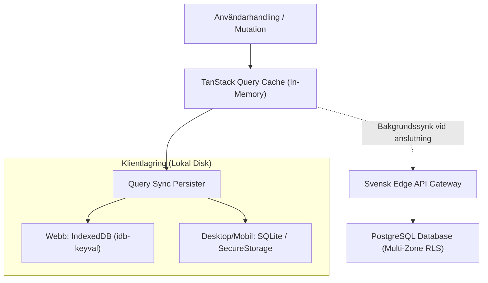

# Yntra Platform: Local-First Arkitektur, Fältresiliens & Synkronisering

Detta dokument beskriver Yntra Platforms principer för **Local-First-arkitektur**, offline-persistens, optimistiska användargränssnitt, samt synkroniserings- och konfliktlösningsmekanismer under extrema svenska förhållanden.

---

## 1. Principer för Local-First Design

Yntra är byggt kring insikten att ett modernt verksamhetssystem aldrig får blockeras av externa nätverksfördröjningar:

1. **Omedelbar Lokal Respons (<1ms)**:
   Alla läsfrågor besvaras direkt ur enhetens primärminne eller persisterade lokala databas. Användaren möts aldrig av blockerande laddningssnurror för lokalt sparad data.
2. **Fullständig Offline-Autonomi**:
   Samtliga kärnfunktioner – tidsredovisning, skiftöversikt, anteckningar, meddelandeskrivning och personalsökning – fungerar till 100 % även vid total frånvaro av internetanslutning.
3. **Optimistiska Uppdateringar (Optimistic UI)**:
   När en användare sparar en anteckning, stämplar in eller byter ett skift, uppdateras gränssnittet omedelbart. Nätverksanropet sker asynkront i bakgrunden.
4. **Deterministisk Återställning (Rollback Fallback)**:
   Om ett bakgrundsanrop avvisas av servern (t.ex. på grund av behörighetsfel eller hård regelvalidering) rullas klientens tillstånd tillbaka kontrollerat med ett tydligt användarmeddelande.

---

## 2. Lagrings- & Persistenshierarki



### 2.1 Konfiguration av Persister (`src/lib/query-client.ts`)
- Använder `@tanstack/query-sync-storage-persister` mot `idb-keyval`.
- Data överlever webbläsaromstarter, minnesrensningar och systemomstarter.
- Konfigurerad med `staleTime: 1000 * 60 * 5` (5 minuter) och `gcTime: 1000 * 60 * 60 * 24 * 7` (7 dagars lokal lagring för offline-arbete).

---

## 3. Fältresiliens i Krävande Svenska Miljöer

Svenskt näringsliv och samhällsservice opererar ofta i miljöer där stabil internetuppkoppling inte kan tas för givet:
- **Gruvdrift och Tunnlar (Kiruna, Malmberget, Förbifart Stockholm)**: Arbete hundratals meter under marken utan mobilmottagning.
- **Skogs- och Glesbygdsverksamhet**: Skogsmaskinsförare och fjällräddning i Norrlands inland med sporadisk satellitkontakt.
- **Sjukhuskulvertar, Skyddsrum & Bergrum**: Tjocka betong- och bergväggar som skärmar av radiovågor.
- **Skärgård och Sjöfart**: Färjor och skärgårdsbåtar med intermittent uppkoppling.

### 3.1 Hur Yntra Hanterar Nätverksbortfall
1. **Realtidsindikator via PAL**: `usePlatform().isOffline` detekterar omedelbart när nätverket försvinner och visar ett diskret offline-märke i användargränssnittet utan att avbryta arbetsflödet.
2. **Lokal Köbildning (Mutation Queue)**: Alla skapade eller ändrade poster märks med status `pending_sync: true` och lagras i en persistent mutationskö i IndexedDB/SQLite.
3. **Automatisk Tömning vid Återanslutning**: När anslutningen återuppstår detekterar nätverkslyssnaren i PAL detta och triggar en sekventiell tömning av kön med exponentiell backoff och jitter för att undvika överbelastning ("thundering herd").

---

## 4. Konfliktlösning & Dataintegritet

När flera medarbetare redigerar data samtidigt i offline-läge tillämpar Yntra följande deterministiska strategier:

```mermaid
graph TD
    ConflictCheck{"Typ av Entitet?"}
    
    ConflictCheck -->|Strukturerade Fält (Status, Skift, Tider)| LWW["Last-Write-Wins (LWW)<br/>med mikrosekunds-tidsstämpel"]
    ConflictCheck -->|Samarbetsdokument (Anteckningar, Loggböcker)| AppendOnly["Append-Only Event Sourcing<br/>Kollaborativ sammanfogning"]
    
    LWW --> AuditLog["Audit-loggning av konflikt"]
    AppendOnly --> AuditLog
```

### 4.1 Last-Write-Wins (LWW) med Mikrosekunds-Tidsstämpel
För diskreta fält (t.ex. skifttilldelning, närvarostatus, kundadresser) gäller:
- Varje databaspost har ett `updated_at`-fält med tidsstämpel i millisekunder/mikrosekunder från synkroniserad nätverkstid (NTP).
- Vid krock mellan klient och server accepteras mutationen med den senaste tidsstämpeln.
- Den överskrivna versionen sparas i revisionshistoriken så att ingen information raderas oåterkalleligen.

### 4.2 Append-Only Händelseloggar för Samarbetsanteckningar
För delade anteckningar (`src/features/notes/`) och dagliga skiftrapporter:
- Ändringar representeras som en serie odelbara tilläggshändelser (append-only events).
- Händelserna fogas samman utan att skriva över varandras textblock, vilket förhindrar att en fältarbetares anteckningar raderas av en kollega som synkar samtidigt.

---

## 5. Klientkryptering & Rensningsrutiner vid Sessionens Slut

För att garantera att känslig data inte blir kvar på delade arbetsdatorer eller fältplattor:
- Vid användarutloggning eller administrativ tokenspärr raderas alla lokala cache-databaser omedelbart.
- Webbläsarens `indexedDB.deleteDatabase()` anropas för samtliga Yntra-databaser.
- Inga okrypterade tokens eller personuppgifter lagras i `localStorage`.
