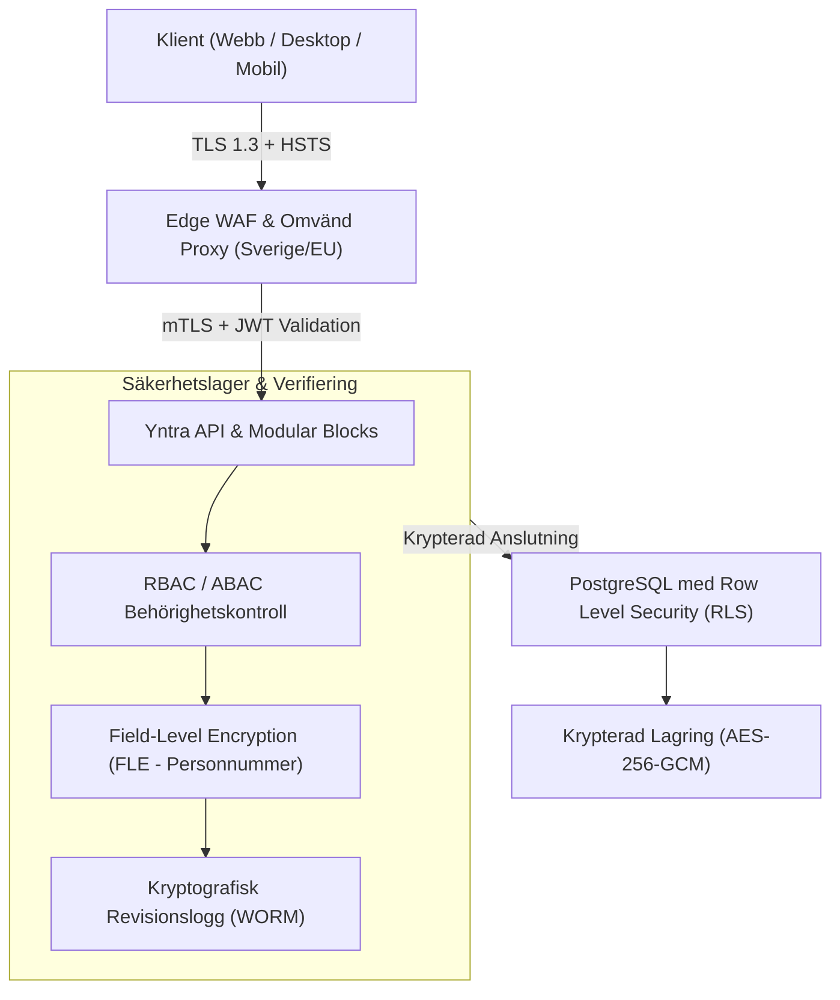
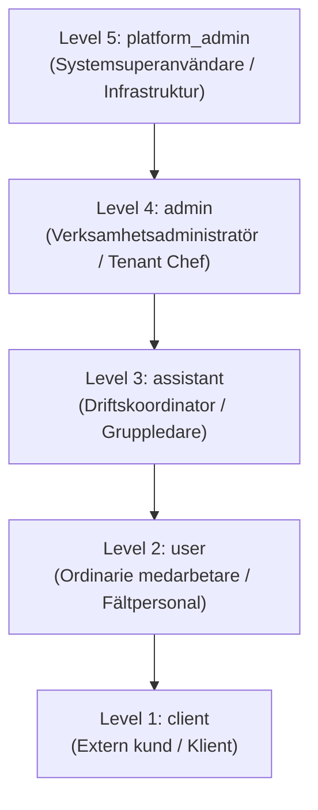
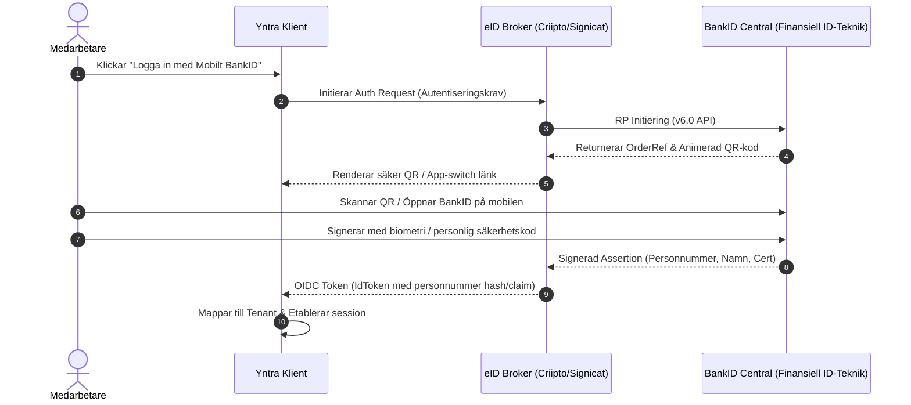

# Säkerhets-, Multi-Tenancy- & Efterlevnadsspecifikation (Svensk Guldstandard)

Denna specifikation fastställer de arkitektoniska, kryptografiska och legala säkerhetsstandarderna för **Yntra Platform**. Systemet är konstruerat för att uppfylla de högsta kraven inom svensk industri, vård och offentlig förvaltning, med full efterlevnad av svensk och europeisk dataskyddslagstiftning.

---

## 1. Säkerhetsfilosofi & Grundprinciper

Yntra bygger på en modern **Zero-Trust-arkitektur** ("Lita aldrig på någon, verifiera alltid allt"):
1. **Försvar på djupet (Defense-in-Depth)**: Säkerhetskontroller appliceras på varje nivå – nätverk, infrastruktur, databas (RLS), applikationslager (Guards), API och klientsida.
2. **Minsta behörighet (Principle of Least Privilege - PoLP)**: Användare, API-nycklar och bakgrundsprocesser tilldelas endast de minimala behörigheter som krävs för att utföra sin uppgift.
3. **Svensk Datasuveränitet**: All data lagras och bearbetas inom Sverige och EU, med full immunitet mot utländsk extraterritoriell jurisdiktion (såsom US CLOUD Act).
4. **Verifierbarhet & Spårbarhet**: Inga administrativa eller känsliga förändringar får genomföras utan en oföränderlig revisionslogg (audit trail).



---

## 2. Svensk & Europeisk Regulatorisk Efterlevnadsmatris

Yntra är designat för att erbjuda direkt efterlevnad mot Sveriges mest centrala säkerhets- och förvaltningslagar:

| Lagstiftning / Standard | Tillsynsmyndighet / Omfattning | Yntras Tekniska Implementering |
| :--- | :--- | :--- |
| **GDPR / Dataskyddsförordningen** | Integritetsskyddsmyndigheten (IMY) | Inbyggd registerförteckning (Art. 30), automatiserat "Rätten att bli raderad"-flöde, dataportabilitet (JSON/CSV-export), 72-timmars automatiserat incidentrapporteringsstöd. |
| **NIS2-direktivet (Cybersäkerhetslagen)** | MSB / Post- och telestyrelsen (PTS) | Riskhanteringsrutiner för väsentliga/viktiga entiteter, tidig varning inom 24 timmar, incidentanmälan inom 72 timmar, strikt leverantörssäkerhetsgranskning. |
| **Bokföringslagen (1999:1078)** | Skatteverket / Bokföringsnämnden | 7 års oförvanskad arkivering av tid- och faktureringsunderlag, obrutna verifikationsserier, WORM-lagring (Write Once Read Many). |
| **Arbetstidslagen (1982:673)** | Arbetsmiljöverket | Automatisk realtidsvalidering av 11 timmars dygnsvila, 36 timmars veckovila och kontroll av övertidstak (max 200 timmar allmän övertid/år). |
| **Säkerhetsskyddslagen (2018:585)** | Säkerhetspolisen (SÄPO) / Försvarsmakten | Stöd för installation i svensk suverän molnmiljö (Safespring/Elastx/Cleura), strikt åtkomstloggning och rollbaserad behörighetssegregering för samhällsviktiga funktioner. |
| **eIDAS (Förordning 910/2014)** | DIGG (Myndigheten för digital förvaltning) | Stöd för svensk e-legitimation med Tillitsnivå Hög (Mobilt BankID och Freja eID+). |

---

## 3. Multi-Tenant Isolering & Databas-säkerhet

Yntra tillämpar en kompromisslös **Row-Level Partitioning**-arkitektur där tenant-data är logiskt separerad på databasnivå:

### 3.1 Databasisolering via PostgreSQL Row Level Security (RLS)
Varje tabell som innehåller verksamhetsdata har kolumnen `workspace_id TEXT NOT NULL` och tvingande RLS-regler:

```sql
-- Exempel på tvingande RLS-policy i PostgreSQL
ALTER TABLE workspace_messages ENABLE ROW LEVEL SECURITY;

CREATE POLICY "Tenant isolation for workspace_messages"
ON workspace_messages
FOR ALL
USING (
  workspace_id = (auth.jwt() -> 'app_metadata' ->> 'workspace_id')
  OR 
  (auth.jwt() -> 'app_metadata' ->> 'role') = 'platform_admin'
);
```

### 3.2 Applikationslagrets Skyddsnät
1. **Strikt Kontextknytning**: Alla förfrågningar genom `src/services/` hämtar automatiskt aktivt `workspace_id` från `WorkspaceContext`. Förfrågningar utan giltigt tenant-ID avvisas innan de lämnar klienten.
2. **Automatiserade Läcke-Tester**: CI-pipelinen kör automatiserade integrationstester där användare från Tenant A försöker läsa och manipulera data från Tenant B. Om en enda rad exponeras blockeras bygget omedelbart.

---

## 4. Rollbaserad Behörighetskontroll (RBAC) & Fina Behörigheter

Yntra tillämpar en femgradig rollhierarki med möjlighet till attributbaserade begränsningar (ABAC):



### 4.1 Behörighetsmatris

| Modul / Funktion | `platform_admin` | `admin` | `assistant` | `user` | `client` |
| :--- | :---: | :---: | :---: | :---: | :---: |
| **Systemkonfiguration & Licenser** | Full | Nej | Nej | Nej | Nej |
| **Användaradministration & Roller** | Full | Tenant | Nej | Nej | Nej |
| **Modulaktivering (Block Registry)** | Full | Tenant | Nej | Nej | Nej |
| **Revisionsloggar (Audit Trail)** | Full | Läs (Tenant) | Nej | Nej | Nej |
| **Skift- & Schemaläggning** | Full | Full | Skapa/Ändra | Egen vy | Nej |
| **Tidsattestering** | Full | Godkänn | Förgranska | Egen tid | Nej |
| **Meddelanden & Internchatt** | Full | Full | Full | Standard | Begränsad tråd |
| **Kundportal (`/home`)** | Simulering | Läs | Nej | Nej | Dedikerad vy |

### 4.2 Säker Rollsimulering (`simulateRole`)
- Exklusivt tillgänglig för `platform_admin` i felsöknings- och kvalitetssäkringssyfte.
- Simuleringen verifieras i `AuthContext.tsx` och sker inom en skyddad sandlåda.
- Alla operationer som utförs under pågående rollsimulering loggas med både den faktiska administratörens identitet och den simulerade rollen i auditloggen.

---

## 5. Identitets- & Åtkomsthantering (Svensk e-Legitimation)



### 5.1 Stödda Autentiseringsmetoder
1. **Mobilt BankID**: Svensk standard för personidentifiering med högsta tillitsnivå.
2. **Freja eID+**: Godkänd svensk e-legitimation med Tillitsnivå 3 (LOA3), särskilt lämpad för kommuner, regioner och skolverksamhet.
3. **FIDO2 / WebAuthn**: Hårdvarunycklar (t.ex. YubiKey) och inbyggd enhetsbiometri (Windows Hello, Touch ID) för administratörer.
4. **Step-Up Autentisering**: Vid kritiska åtgärder (exempelvis godkännande av löneunderlag, massexport av personuppgifter eller behörighetshöjning) krävs en ny BankID-verifiering innan åtgärden exekveras.

---

## 6. Kryptografisk Arkitektur

### 6.1 Data i Rörelse (Data in Transit)
- **Protokoll**: TLS 1.3 (med TLS 1.2 som absolut lägsta fallback med strikta cipher suites).
- **Säkerhetsrubriker**:
  - `Strict-Transport-Security: max-age=63072000; includeSubDomains; preload`
  - `Content-Security-Policy: default-src 'self'; ...`
  - `X-Frame-Options: DENY`
  - `X-Content-Type-Options: nosniff`
  - `Referrer-Policy: strict-origin-when-cross-origin`

### 6.2 Data i Vila (Data at Rest)
- Databaslagring, säkerhetskopior och fillagring är helkrypterade med **AES-256-GCM**.
- Krypteringsnycklar hanteras i dedikerade Hardware Security Modules (HSM) eller Key Management Services (KMS) inom svensk jurisdiktion.

### 6.3 Fältskryptering (Field-Level Encryption - FLE)
För extra känsliga datafält – särskilt **svenska personnummer (12 siffror)**, hälsouppgifter vid sjukanmälan och känsliga anteckningar – tillämpas fältskryptering:
- Fältet krypteras med en unik datanyckel (DEK) innan det skrivs till databasen.
- Datanyckeln är i sin tur krypterad med en tenant-specifik huvudnyckel (KEK).
- Även om en obehörig skulle få direktåtkomst till databasens råfiler förblir personnumren matematiskt oåtkomliga.

### 6.4 Klientlagring & Minnessäkerhet
- Persistent offline-data i webbläsaren sparas i `IndexedDB` via `idb-keyval`.
- Vid utloggning eller sessionstimeout körs en garanterad rensningsrutin:
  ```typescript
  // Fullständig sanering av lokalt tillstånd vid sessionens slut
  await queryClient.clear();
  await clearIndexedDbStores();
  sessionStorage.clear();
  ```

---

## 7. Oföränderlig Revisionslogg (Immutable Audit Trail)

För att uppfylla kraven i Bokföringslagen och NIS2 sparar Yntra alla administrativa händelser i en skrivskyddad, oföränderlig logg.

### 7.1 Revisionsloggens Datastruktur
Varje händelse registreras med följande schema:
```json
{
  "event_id": "aud_9a8b7c6d5e",
  "workspace_id": "ws_sthlm_vard_01",
  "timestamp": "2026-09-20T14:30:15.123Z",
  "actor": {
    "user_id": "usr_anna_andersson",
    "role": "admin",
    "ip_hash": "e3b0c44298fc1c149afbf4c8996fb92427ae41e4649b934ca495991b7852b855",
    "user_agent": "YntraDesktop/1.0.0 (Windows NT 10.0; Win64; x64)"
  },
  "action": "user.role.updated",
  "target": {
    "entity_type": "user",
    "entity_id": "usr_erik_svensson"
  },
  "changes": {
    "role": { "from": "user", "to": "assistant" }
  },
  "legal_retention_until": "2033-09-20T14:30:15.123Z",
  "previous_hash": "2c26b46b68ffc68ff99b453c1d30413413422d706483bfa0f98a5e886266e7ae",
  "signature": "MEQCIDz8F7...k3L9A=="
}
```

### 7.2 Skydd mot Manipulation (WORM)
- Loggposter kedjas ihop med kryptografiska hashvärden (likt en certifikatkedja).
- Loggarna skrivs till WORM-kompatibel lagring (Write Once, Read Many) som förhindrar borttagning eller ändring även för databasadministratörer.
- Automatisk export till centrala SIEM-system (Security Information and Event Management) via syslog eller OpenTelemetry.

---

## 8. Incidenthantering & Sårbarhetsarbete

### 8.1 72-Timmars Incidentrapportering (IMY & NIS2)
Vid misstänkt eller konstaterad personuppgiftsincident aktiveras Yntras automatiserade incidentresponsplan:
1. **Inom 4 timmar**: Incidentteamet isolerar påverkade nätverk och spärrar berörda API-nycklar eller sessioner.
2. **Inom 24 timmar**: Tidig varning och preliminary incidentrapport sammanställs för NIS2-ansvarig myndighet (MSB).
3. **Inom 72 timmar**: Formell anmälan skickas till Integritetsskyddsmyndigheten (IMY) via deras e-tjänst, innehållande beskrivning av incidentens art, berörda kategorier och åtgärder som vidtagits.
4. **Information till registrerade**: Om incidenten innebär hög risk för de registrerades rättigheter informeras berörda användare utan onödigt dröjsmål via e-post och Yntras appgränssnitt.

### 8.2 Regelbundna Säkerhetstester & Pentest
- **Automatiserad kodanalys (SAST/DAST)**: Varje Pull Request skannas för sårbarheter, osäkra beroenden (Dependabot/Snyk) och hemligheter.
- **Årlig Penetrationstestning**: Minst en gång per år genomförs oberoende penetrationsprovning av ett ackrediterat svenskt cybersäkerhetsföretag enligt OWASP ASVS Nivå 3.
