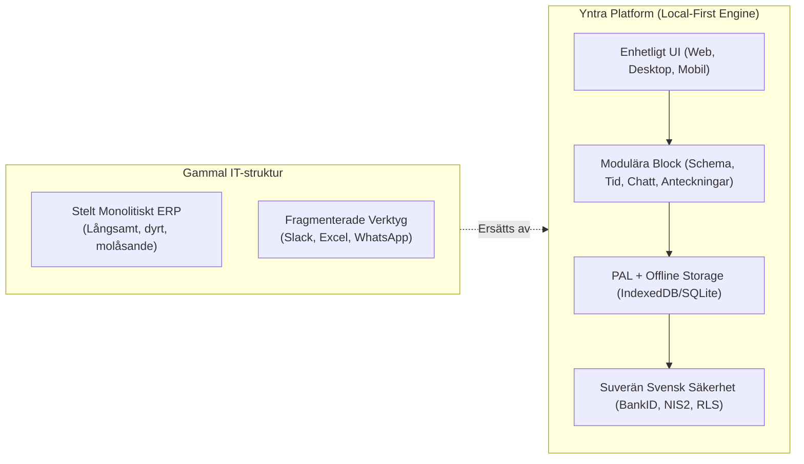
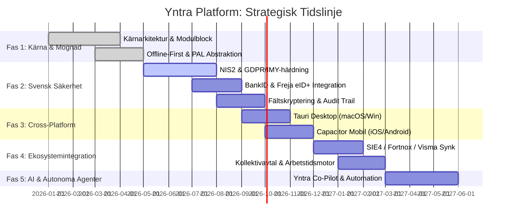

# Yntra Platform: Strategisk Masterplan & Färdplan (2026–2028)

Detta dokument utgör den strategiska och tekniska masterplanen för hur **Yntra Platform** utvecklas och etableras som **Sveriges ledande, säkraste och mest anpassningsbara verksamhetsplattform**.

---

## 1. Vision & Marknadsdifferentiering

### 1.1 Problemet med Befintliga Verksamhetssystem
Dagens svenska organisationer – från medelstora tillväxtbolag till vårdgivare, tillverkande industri och offentliga förvaltningar – plågas av två ytterligheter:
1. **Traditionella Affärssystem (ERP:er)** (t.ex. äldre installationer av Visma, Microsoft Dynamics, SAP):
   - Extremt tröga svarstider (TTI > 3–5 sekunder).
   - Statiska, oöverskådliga och föråldrade användargränssnitt.
   - Dyra och riskfyllda anpassningar som tar månader eller år att implementera.
   - Dålig eller obefintlig mobil- och offlinestöd för fältarbetare och personal på golvet.
2. **Fragmenterade Punktsystem**:
   - Ett system för meddelanden (Slack/Teams), ett för schemaläggning (Quinyx/Timeplan), ett för tidsrapportering och ett för dokumentation.
   - Resultatet blir informationssilos, dubbelarbete, osäkra dataläckor och bristande efterlevnad av svenska lagar.

### 1.2 Yntras Unika Värdeerbjudande ("The Unfair Advantage")
Yntra förenar flexibiliteten hos moderna konsumentappar med de rigorösa säkerhets- och efterlevnadskraven i svensk enterprise- och offentlig sektor:
- **Sub-millisekunds Responsivitet (Local-First)**: Data läses och muteras omedelbart i klientens lokala minne/lagring. Inga blockerande laddningssnurror.
- **Dynamisk Blockarkitektur**: Varje organisation aktiverar exakt de moduler de behöver (Meddelanden, Schema, Tidsredovisning, Anteckningar, Katalog, AI-assistans).
- **Äkta Plattformsoberoende (Webb, Skrivbord, Mobil)**: En enda React 19/TypeScript-kodbas med en kraftfull abstraktionslager (**PAL**) som levererar inbyggd prestanda på webbläsare, macOS/Windows (Tauri) och iOS/Android (Capacitor).
- **Sveriges Säkraste Plattform**: Designad från grunden för **GDPR/IMY**, **NIS2**, **Bokföringslagen**, **Arbetstidslagen**, **Säkerhetsskyddslagen**, BankID-autentisering och suverän svensk molndrift.

---

## 2. Strategiska Pelare

| Pelare | Princip | Konkret Mål |
| :--- | :--- | :--- |
| **1. Prestanda & Resiliens** | Local-First & Zero Latency | < 1 ms lokala läsningar, < 800 ms TTI, 100% offline-funktionalitet vid nätverksbortfall. |
| **2. Suverän Säkerhet** | Zero-Trust & Svensk Efterlevnad | Fältskryptering av personnummer, BankID/Freja eID+, IMY/NIS2-efterlevnad, data i Sverige. |
| **3. Modulär Flexibilitet** | Plug-and-Play Block Registry | Slå på/av funktioner per tenant utan driftstopp eller kodändringar. |
| **4. Skandinavisk UX-Klass** | Estetik & Användarglädje | Världsledande design, subtil glasmorfism, mörkt/ljust tema, responsiv perfektion på alla skärmar. |
| **5. AI & Automatisering** | Människa-i-slingan (HITL) | Intelligenta verksamhetsassistenter för automatiserad avvikelsehantering, schemaläggning och auditkontroll. |

---

## 3. Flerfasig Färdplan (Roadmap)

### Fas 1: Kärna & Modulmognad (Avklarad / Pågående förfining)
- **Fokus**: Stabilisering av plattformens fundamentala byggstenar.
- **Viktiga Milstolpar**:
  - Implementering av de åtta kärnblocken (`dashboard`, `messaging`, `scheduling`, `notes`, `directory`, `time`, `reporting`, `assistance`).
  - Etablering av Platform Abstraction Layer (`src/platform/`) med fullständig typdeklaration för webb, skrivbord och mobil.
  - TanStack Query v5 och persistering till IndexedDB (`idb-keyval`) för omedelbar responsivitet.
  - Tvåspråkigt stöd (svenska och engelska) med automatisk språkväxling.
  - Rollsimulering i realtid för administratörer (`simulateRole`).

### Fas 2: Svensk Säkerhet & Efterlevnadshärdning (Aktuell Prioritet)
- **Fokus**: Etablera Yntra som Sveriges säkraste verksamhetsmotor.
- **Viktiga Milstolpar**:
  - **GDPR & IMY-anpassning**: Rätten att bli raderad (automatiserat raderingsflöde), registerförteckning enligt Art. 30, inbyggd hantering av samtycke och personuppgiftsbiträdesavtal (PUB).
  - **NIS2-direktivet**: Implementering av 24-timmars tidig varning och 72-timmars incidentrapportering, kontinuerlig sårbarhetsbedömning och strikt leverantörssäkerhet.
  - **Svensk e-legitimation (BankID & Freja eID+)**: Stöd för identifiering och digital signering vid kritiska händelser (lönegodkännande, behörighetsändringar).
  - **Fältskryptering (FLE)**: Skydd av känsliga fält (svenska personnummer, anteckningar med känslig personalinformation) med kryptering på klient- eller applikationslagret innan persistens.
  - **Oföränderlig Auditlogg**: Revisionskedja som uppfyller kraven i Bokföringslagen (7 års bevarande, WORM-lagring).

### Fas 3: Cross-Platform Native Shells (Desktop & Mobil)
- **Fokus**: Leverera äkta infödda upplevelser på alla hårdvaruplattformar.
- **Viktiga Milstolpar**:
  - **Desktop (Tauri 2.0)**:
    - Minnesfotavtryck < 35 MB, starttid < 300 ms.
    - Systemfält (System Tray) med olästa meddelanderäknare.
    - Globala snabbkommandon (t.ex. `Ctrl/Cmd + Shift + Y` för snabbanteckning eller tidsstämpling).
  - **Mobil (Capacitor 6.0)**:
    - Optimerat pekgränssnitt med haptisk återkoppling (`platform.haptics`).
    - Biometrisk inloggning (Face ID / Touch ID / Android Biometrics).
    - APNs och FCM pushnotiser med djuplänkning till specifika skift och meddelandetrådar.
    - Full offline-drift med bakgrundssynkning när täckning återfås.

### Fas 4: Svenska Ekosystemintegrationer
- **Fokus**: Sömlös samverkan med det svenska näringslivets standardsystem.
- **Viktiga Milstolpar**:
  - **SIE4-Standard & Ekonomisystem**: Automatisk export av tid- och faktureringsunderlag till Fortnox, Visma Administration, Visma eEkonomi och Björn Lundén.
  - **Kollektivavtals- och Arbetstidsmotor**:
    - Automatisk kalkylering av OB-tillägg (kväll, natt, helg, storhelg).
    - Realtidsvalidering mot Arbetstidslagen: larm vid överträdelse av 11 timmars dygnsvila, 36 timmars veckovila eller övertidstak (max 200h/år).
  - **Kivra Företagsdistribution**: Möjlighet att skicka lönespecifikationer och officiella personalkontrakt direkt till anställdas och kunders Kivra.

### Fas 5: Autonoma AI-Agenter & Verksamhetsassistans
- **Fokus**: Intelligent automatisering med människan i kontroll ("Human-in-the-Loop").
- **Viktiga Milstolpar**:
  - **Intelligent Schemagenerering**: Automatisk bemanning baserad på historisk beläggning, semesterönskemål och kollektivavtalskrav.
  - **Tidrapportsgranskning**: AI-detektering av tidstämplingsavvikelser och dubbelbokningar före attest.
  - **Prediktiv Resursplanering**: Prognoser för personalbehov och projektlönsamhet.

---

## 4. Kritiska Mätetal & Kvalitetsmål (KPI:er)

För att garantera marknadens högsta standard mäts och övervakas följande tekniska och operativa mål kontinuerligt:

| Mätetal | Målvärde | Verifieringsmetod |
| :--- | :--- | :--- |
| **Lokala läsningar (Query Cache)** | < 1 ms | TanStack Query in-memory cache |
| **Time to Interactive (TTI)** | < 800 ms | Web Vitals & Lighthouse CI |
| **Systemtillgänglighet (SLA)** | 99.95 % | Uptime-övervakning över distribuerade noder |
| **RPO (Recovery Point Objective)** | < 5 minuter | Kontinuerlig WAL-arkivering i PostgreSQL |
| **RTO (Recovery Time Objective)** | < 15 minuter | Automatiserat infrastruktur-återskapande |
| **Dataläckage mellan tenants** | 0 incidenter | Automatiserade RLS-integrationstester |
| **Kryptografisk styrka** | AES-256-GCM / TLS 1.3 | Årlig oberoende tredjeparts-penetrationstestning |
| **Offline-driftbarhet** | 100 % läs & skriv | Playwright E2E offline-scenarier |

---

## 5. Hur Vi Går Till Väga – Arkitektoniska Principer

1. **Inga Dolda Beroenden**: Alla externa tjänster (BankID, pushnotiser, molnlagring) är kapslade bakom gränssnittsadaptrar så att leverantörer kan bytas ut utan att röra UI eller affärslogik.
2. **Defensiv Säkerhet som Standard**: Varje nätverksanrop, databasfråga och användarinteraktion förutsätter fientlig miljö. Alla data valideras i både frontend och backend (Zod-scheman och Postgres constraints).
3. **Minsta Möjliga Datainsamling (Dataminimering)**: Vi sparar endast vad som krävs för verksamheten. Loggar anonymiseras eller pseudonymiseras efter utgången legaltid.
4. **Respekt för Svensk Integritet**: Data stannar inom Sveriges/EU:s gränser under skydd mot utländska övervakningslagar.
