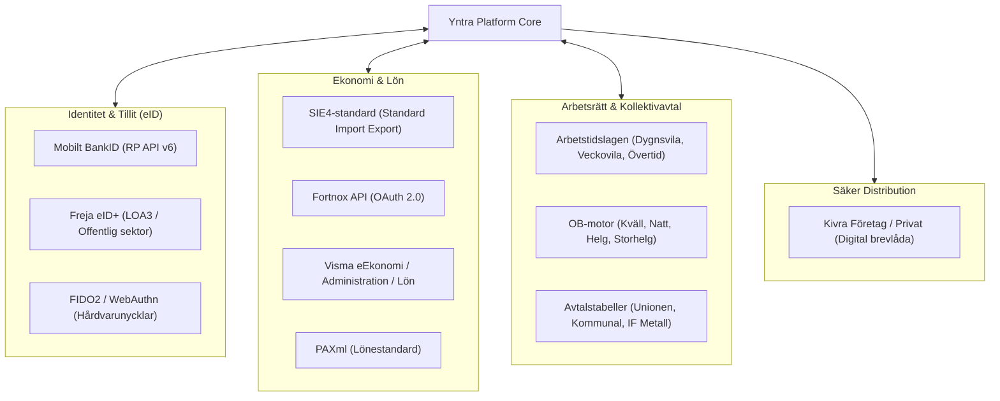

# Svensk Enterprise- & Ekosystemintegration

Detta dokument beskriver den tekniska arkitekturen och implementationsguiden för integration mellan **Yntra Platform** och det **svenska näringslivets och offentliga sektorns ekosystem** – inklusive BankID, Freja eID+, ekonomisystem (SIE4/Fortnox/Visma), kollektivavtalsregler och digital myndighetspost (Kivra).

---

## 1. Översikt över det Svenska Ekosystemet

För att en verksamhetsplattform ska kunna klassas som Sveriges bästa och mest relevanta lösning krävs djup, sömlös integration med de standarder och infrastrukturer som styr svenskt arbetsliv:



---

## 2. Svensk e-Legitimation: BankID & Freja eID+

Autentisering och juridiskt bindande signering i Yntra hanteras via svensk e-legitimation med högsta tillitsnivå (eIDAS Level of Assurance High).

### 2.1 BankID Relying Party (RP) v6.0 Arkitektur
Yntra stöder både direkta RP v6-anrop och integration via certifierad eID-broker (t.ex. Criipto eller Signicat):

#### 2.1.1 Flöde 1: Skrivbord / Webb (Animerad QR-kod)
För att skydda mot nätfiske och man-in-the-middle-attacker (MITM) genererar Yntra en dynamisk, animerad QR-kod enligt BankIDs v6.0-standard:
1. Klienten begär inloggning och erhåller `orderRef` och starttoken.
2. QR-koden uppdateras varje sekund baserat på en tidsbaserad HMAC-algoritm (`bankid.qr = HMAC-SHA256(qrStartSecret, qrTime)`).
3. Användaren skannar QR-koden med BankID-appen på sin smartphone och verifierar med Face ID eller säkerhetskod.
4. Yntra pollar säkert mot backend och tar emot signerad assertion med personnummer.

#### 2.1.2 Flöde 2: Mobil Enhet (Automatisk App-växling)
När användaren kör Yntra i mobilwebbläsaren eller via Capacitor-appen:
1. Klienten anropar `bankid:///?autostarttoken={token}&redirect={returnUrl}`.
2. Enheten växlar automatiskt över till BankID-appen.
3. Vid slutförd identifiering återvänder BankID direkt till Yntra via registrerad URL-scheme (`yntra://auth/callback`).

### 2.2 Freja eID+ för Offentlig Sektor och Kommuner
För kommuner, regioner och skolor där alla medarbetare eller konsulter inte har svenskt BankID (eller föredrar en ren tjänstelegitimation) erbjuder Yntra stöd för **Freja eID+**:
- Uppfyller DIGG:s krav på Tillitsnivå 3 (LOA3).
- Tillåter organisations-eID (Freja OrgID) kopplat till medarbetarens tjänsteidentitet utan att privata personuppgifter exponeras i onödan.

### 2.3 Steg-för-steg Autentisering (Step-Up Auth)
Vissa åtgärder i Yntra klassas som **högriskoperationer** och kräver en ny BankID-signering även om användaren redan är inloggad:
- Attestering och godkännande av slutgiltiga löneunderlag.
- Bemyndigande av nya systemadministratörer (`platform_admin`).
- Ändring av organisationsbankgironummer eller betalningsinstruktioner.
- Radering av hela workspace-databaser ("Right to be Forgotten" i bulk).

---

## 3. Ekonomisystem & SIE4-Export

För att eliminera manuell administration integrerar Yntras tidrapporterings- och schemamoduler direkt med Sveriges dominerande redovisnings- och lönesystem.

### 3.1 SIE4-Standard (Standard Import Export)
Yntra genererar fullständiga, validerade **SIE4-filer** enligt Föreningen SIE:s specifikation för import till valfritt svenskt bokföringsprogram:

```text
#FLAGGA 0
#PROGRAM "Yntra Platform" 1.0
#FORMAT PC8
#GEN 20260920
#SIETYP 4
#FNAMN "Exempelbolaget AB"
#ORGNR 556123-4567
#VALUTA SEK
#KONTO 1510 "Kundfordringar"
#KONTO 3001 "Försäljning tjänster 25% moms"
#KONTO 2611 "Utgående moms 25%"
#VER "Y" 101 20260920 "Fakturerbar tid Konsultuppdrag v38"
{
   #TRANS 1510 {} 12500.00 20260920 "Projekt Yntra Implementation"
   #TRANS 3001 {} -10000.00 20260920 "Projekt Yntra Implementation"
   #TRANS 2611 {} -2500.00 20260920 "Utgående moms"
}
```

### 3.2 Direktintegration med Fortnox & Visma
1. **Fortnox API (OAuth 2.0)**:
   - **Tidsregistrering**: Synkning av tidstransaktioner mot Fortnox Tid / Projekt per artikelkod och medarbetarnummer.
   - **Fakturaunderlag**: Automatisk omvandling av godkända tidsrapporter till fakturautkast i Fortnox Faktura.
   - **Frånvaro & Ledighet**: Automatisk överföring av sjukanmälningar och semester till Fortnox Lön.
2. **Visma eEkonomi & Visma Lön**:
   - Automatisk generering av lönefiler i **PAXml**-format för import i Visma Lön 300/600 och Hogia Lön.

---

## 4. Svensk Kollektivavtals- och Arbetstidsmotor

Yntras schemaläggnings- och tidrapporteringsmodul (`src/features/scheduler/` och `src/features/time/`) innehåller en regelmotor anpassad för svensk arbetsrätt och centrala kollektivavtal:

### 4.1 Arbetstidslagens (ATL) Hårdvalidering
Systemet blockerar automatiskt eller varnar administratören vid schemaläggning som bryter mot svensk lag:
1. **11 timmars sammanhängande dygnsvila** (ATL 13 §):
   - Minst 11 timmars sammanhängande vila per 24-timmarsperiod. Om ett skift slutar 22:00 kan inte nästa skift påbörjas förrän tidigast 09:00 dagen därpå.
2. **36 timmars sammanhängande veckovila** (ATL 14 §):
   - Minst 36 timmars sammanhängande ledighet under varje period om sju dagar, företrädesvis förlagd till veckoslutet.
3. **Övertidstak (ATL 8 §)**:
   - Max 48 timmars allmän övertid under en period om 4 veckor.
   - Max 200 timmars allmän övertid per kalenderår. Systemet larmar i gult vid 160 timmar och rött vid 200 timmar.

### 4.2 OB-tillägg & Arbetstidsavtal
Motorn stödjer dynamiska regler för oläglig arbetstid:
- **Kvälls-OB**: Vardagar kl 18:00 – 22:00.
- **Natt-OB**: Vardagar kl 22:00 – 06:00.
- **Helg-OB**: Fredag kl 18:00 – Måndag kl 06:00.
- **Storhelgs-OB**: Trettondagsafton, Långfredag, Påskhelg, Första maj, Kristi himmelsfärd, Nationaldagen, Midsommarafton, Julafton och Nyårsafton.

Reglerna definieras i anpassningsbara avtalstabeller som matchar organisationens kollektivavtal (t.ex. *Tjänstemannaavtalet Unionen*, *Vård & Omsorg Kommunal*, *Teknikavtalet IF Metall*).

---

## 5. Säker Meddelandedistribution: Kivra

För att säkerställa att officiella handlingar når mottagaren på ett juridiskt säkert sätt erbjuder Yntra distribution via **Kivra**:
- **Lönespecifikationer**: Direkt leverans till den anställdes personliga Kivra-brevlåda (cirka 6 miljoner anslutna svenskar).
- **Anställningsavtal & Tystnadspliktsförbindelser**: Digitalt undertecknande med BankID i Kivra med automatisk arkivering i Yntras personalkatalog (`src/features/directory/`).
- **Skiftkallelser vid kris**: Prioriterade pushmeddelanden till personal vid akut behov av extrainringning eller katastrofläge.
