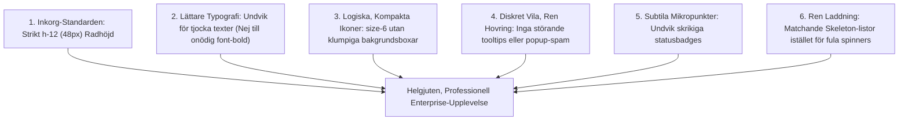
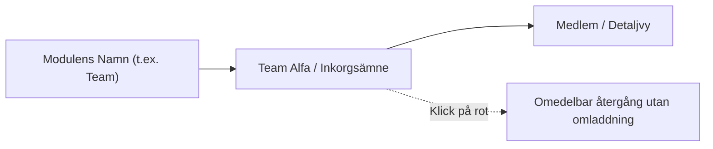
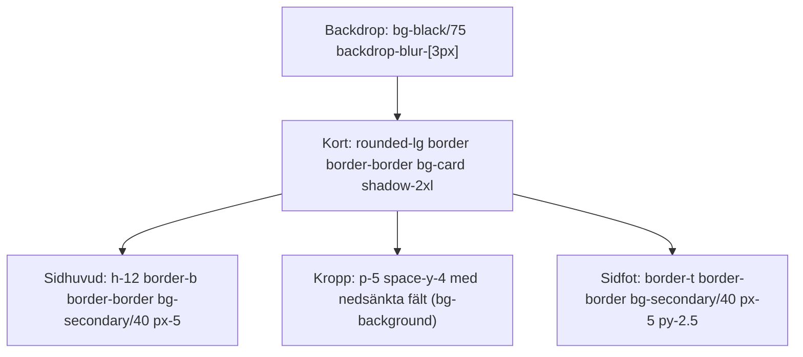

# Yntra Platform: Designsystem, UI-Riktlinjer & Ergonomi

Detta dokument fastställer de officiella, bindande design- och ergonomiriktlinjerna för **Yntra Platform**. Riktlinjerna bygger på iterativa designbeslut framtagna i nära samarbete med produktägaren och är obligatoriska för alla framtida utvecklare och bidragsgivare.

---

## 1. Kärnfilosofi: Skandinavisk Minimalism & "Gör Inte För Mycket"

Yntra är ett snabbt och modernt verksamhets-OS avsett för daglig, intensiv användning. Designen ska kännas:
- **Lugn och fri från visuell störning**: Gränssnittet ska inte överraska med onödiga popups, blinkande pulserande prickar eller aggressiva färgbadges.
- **Hög och elegant informationstäthet**: Användaren ska se all relevant information direkt utan onödig scrollning eller uppsvällda marginaler.
- **Enhetlig ("Inkorg-Standarden")**: Alla listvyer (Inkorg, Anteckningar, Organisationer, Team, Personal, Tidrapporter och Skift) ska följa exakt samma visuella layout, höjd och struktur.

---

## 2. De 6 Grundpelarna



---

## Pelare 1: "Inkorg-Standarden" – Strikt `h-12` (48px) Listlayout

Alla primära datalistor i systemet ska ha samma rytm och struktur som **Inkorgen**:

### 1.1 Exakt Radhöjd & Struktur
- **Radhöjd**: Strikt `h-12` (48px) med `border-b border-border/40 px-6`.
- **Inga uppsvällda marginaler**: Använd **aldrig** `py-4`, `py-5` eller `p-6` på listrader.
- **Inga avslutande pilar/chevrons**: Rader ska **inte** ha `<ChevronRight className="h-5 w-5" />` i radslutet. Det stjäl utrymme och skräpar ner gränssnittet.

### 1.2 Den 3-Kolumniga Standarden
Varje rad är uppbyggd med tre distinkta zoner:
1. **Vänsterkolumn (Namn & Identitet)**:
   - Kompakt ikon/avatar (`size-6`) med `mr-3`.
   - Fast bredd: `w-36 sm:w-48 md:w-56 shrink-0 truncate pr-3`.
   - Text: `text-sm font-medium text-foreground transition-colors group-hover:text-primary`.
2. **Mittkolumn (Kontext, Utdrag eller Detaljer)**:
   - Flexibel bredd: `flex min-w-0 flex-1 items-center gap-x-2 truncate pr-6`.
   - Text: `text-sm font-light italic text-muted-foreground/60 truncate`.
   - Innehåller t.ex. meddelandeutdrag, vårdtagare, tidsintervall eller organisationstyp.
3. **Högerkolumn (Status, Siffror & Åtgärder)**:
   - Bredd: `flex w-48 sm:w-52 shrink-0 items-center justify-end gap-3`.
   - Statusmikropunkt eller tabulära siffror (`tabular-nums text-xs text-muted-foreground/60`).
   - Svävande snabbknappar (t.ex. Ta bort/Arkivera) som glider in smidigt vid hovring:
     `opacity-0 group-hover:opacity-100 transition-opacity`.

```tsx
// Standardmonster for alla listor (Inkorg, Anteckningar, Team, Tidrapport)
<div
  key={item.id}
  onClick={() => handleOpen(item.id)}
  className="group flex h-12 cursor-pointer items-center border-b border-border/40 px-6 transition-all duration-200 hover:bg-secondary/40"
>
  {/* 1. Ikon / Avatar */}
  <div className="mr-3 flex size-6 shrink-0 items-center justify-center text-muted-foreground/70 group-hover:text-primary">
    <Users className="h-4 w-4" />
  </div>

  {/* 2. Namn / Titel */}
  <div className="w-36 sm:w-48 md:w-56 shrink-0 truncate pr-3 text-sm font-medium text-foreground group-hover:text-primary">
    {item.title}
  </div>

  {/* 3. Kontext / Beskrivning */}
  <div className="flex min-w-0 flex-1 items-center gap-x-2 truncate pr-6">
    <span className="truncate text-sm font-light italic text-muted-foreground/60">
      {item.description}
    </span>
  </div>

  {/* 4. Metadata / Status */}
  <div className="flex w-52 shrink-0 items-center justify-end gap-3">
    <StatusBadge status={item.status} />
    <span className="font-mono text-xs tabular-nums text-muted-foreground/60">
      {item.date}
    </span>
  </div>
</div>
```

---

## Pelare 2: Typografi – Inga "För Tjocka Texter"

En av användarens viktigaste korrigeringar var att **ta bort överdriven fetstil**:
> *"för tjock texter använd inte så tjocka texter"*

Undvik slentrianmässig `font-bold` (700) och hård `font-semibold` (600) på nästan alla texter, vilket gör att gränssnittet känns tungt och klumpigt.

### Typografisk Hierarki:
| Element | Tillåten font-weight | Klasser |
| :--- | :--- | :--- |
| **Sidhuvud & Vyrubriker** | Medium (500) | `text-base font-medium tracking-tight text-foreground` |
| **Radnamn, Entiteter, Titlar** | Medium (500) | `text-sm font-medium text-foreground` |
| **Utdrag, Beskrivningar, Innehåll** | Light (300) eller Normal (400) | `text-sm font-light italic text-muted-foreground/60` |
| **Datum, Klockslag, Paginering** | Medium (500) | `text-xs font-medium tabular-nums text-muted-foreground` |
| **Formuläretiketter** | Medium (500) | `text-xs font-medium text-muted-foreground` |
| **KPI-Siffror i Dashboards** | Bold (700) – *endast här!* | `text-2xl font-bold tracking-tight text-foreground` |

> [!IMPORTANT]
> Använd **aldrig** `font-bold uppercase tracking-widest` på sekundära etiketter, datum eller paginering (t.ex. `1 / 10`). Använd istället `text-xs font-medium tabular-nums text-muted-foreground`.

---

## Pelare 3: Logiska, Kompakta Ikoner (Inga Klumpiga Lådor)

Användarens instruktion:
> *"men iconerna för människor osv borde vara kvar / users osv ,fixa allt logiskt"*

Ikoner ska bevaras för snabb visuell igenkänning, men de måste vara **kompakta och minimalistiska**:
1. **Storlek**: Alltid `size-6` (24x24px) yttre behållare med en `h-4 w-4` eller `h-3.5 w-3.5` ikon.
2. **Inga fyrkantiga bakgrundsboxar**: Ta bort alla `h-11 w-11 bg-secondary/80 rounded-lg`-boxar som blåser upp raderna.
3. **Logiska ikoner per domän**:
   - **Person / Anställd**: Kompakt `size-6` avatar med initial (`<Avatar className="size-6 border border-border/60">`) eller `<User className="h-4 w-4" />`.
   - **Team / Grupp**: `<Users className="h-4 w-4" />`.
   - **Organisation / Arbetsyta**: `<Building2 className="h-4 w-4" />`.
   - **Vårdtagare / Brukare**: `<HeartPulse className="h-3.5 w-3.5" />`.
   - **Anteckning / Dokument**: `<FileText className="h-4 w-4" />`.
   - **Tid / Skift**: `<Clock className="h-3.5 w-3.5" />` eller `<FileCheck className="h-4 w-4" />`.

---

## Pelare 4: Interaktivitet – Diskret i Vila, Ren vid Hovring ("Gör Inte För Mycket")

Användarens instruktioner under kalender- och tidsarbetet:
> *"nej gör så här, ta bort bg och bakgrunden från den och sedan ändra färgen till mer genom skinlig och sedn när man overar över pass eller över sträcket eller liknande så blir de röd"*
> *"du gör för mycket, ta bort hover tooltip eller popup delen? wtf? och sedan ta bort puls grejen röda pricken"*

### Riktlinjer för Interaktivitet & Hovring:
1. **Ingen visuell spam**:
   - Skapa **aldrig** flytande hover-tooltips, popovers eller hjälpbubblor som dyker upp automatiskt över innehåll och skymmer grannfält.
   - Använd **aldrig** pulserande animationer (`animate-pulse`) på indikatorer om det inte explicit begärts.
2. **Viloläge (Resting state)**:
   - Bakgrundsfritt, genomskinligt och diskret (`opacity-40` till `opacity-60`).
3. **Aktivt hovringsläge (Active hover)**:
   - När användaren hovrar över ett relevant element (t.ex. ett arbetspass eller en specifik linje) ska elementet reagera distinkt och skarpt (t.ex. solid röd färg, `transition-colors duration-150`), utan att öppna några popups.
   - När muspekaren lämnar återgår allt omedelbart till det lugna viloläget.

---

## Pelare 5: Subtila Mikropunkter istället för Skrikiga Badges

Färgstarka piller ("badges") för allt förfular gränssnittet och skapar visuell stress.

### Förbjudet:
```tsx
// Förbjudet: Skrikig neonbadge med fet stil och hög kontrast
<span className="rounded-full bg-emerald-500/20 px-3 py-1 text-xs font-bold text-emerald-400 border border-emerald-500/30">
  Active
</span>
```

### Korrekt (Subtil Mikropunkt):
```tsx
// Korrekt: Enkel text med en 6px mikropunkt
<div className="flex items-center gap-1.5 text-xs text-muted-foreground">
  <span className="h-1.5 w-1.5 rounded-full bg-emerald-500 shrink-0" />
  <span>Aktiv</span>
</div>
```

| Status | Färg på mikropunkt |
| :--- | :--- |
| **Klar / Godkänd / Aktiv** | `bg-emerald-500` |
| **Väntar / Under attest** | `bg-amber-500` |
| **Ej inlämnad / Utkast** | `bg-muted-foreground/40` |
| **Avvisad / Farlig** | `bg-rose-500` |

---

## Pelare 6: Ren Laddning & Harmoniska Skeletons

Användarens instruktion:
> *"kan du fixa bättre loading, den är inte nice, vill ha clean och passande, fixa även skeleton"*

- **Inga blockerande vita spinners** eller rå text som `"Laddar..."`.
- Använd alltid **skeleton-mönster** som speglar den exakta layouten på listan som laddas:

```tsx
// Korrekt skeleton for listor
<div className="flex w-full flex-col text-sm">
  {[1, 2, 3, 4, 5, 6].map((i) => (
    <div
      key={i}
      className="flex h-12 w-full animate-pulse items-center border-b border-border/40 px-6"
    >
      {/* 1. Ikon-placeholder */}
      <div className="mr-3 size-6 shrink-0 rounded-full bg-muted" />
      {/* 2. Namn-placeholder */}
      <div className="w-36 sm:w-48 md:w-56 shrink-0 pr-3">
        <div className="h-3.5 w-28 rounded bg-muted" />
      </div>
      {/* 3. Innehålls-placeholder */}
      <div className="min-w-0 flex-1 pr-6">
        <div className="h-3 w-40 rounded bg-muted/60" />
      </div>
      {/* 4. Metadata-placeholder */}
      <div className="flex w-52 shrink-0 items-center justify-end gap-3">
        <div className="h-3 w-16 rounded bg-muted/50" />
        <div className="h-3 w-10 rounded bg-muted/60" />
      </div>
    </div>
  ))}
</div>
```

---

## 3. Kompakta Kontroller & Inställningar-Standarden (Formulär & Knappar)

Alla kontroller över hela applikationen – inte bara i Inställningar – måste strikt följa de kompakta, ergonomiska standardmåtten:

### 3.1 Input-fält, Dropdowns & Textareas
- **Textfält (`<Input />`)**: Strikt **`h-8` (32px)** med `px-2.5 py-1 text-xs rounded-md`. Använd **aldrig** 36px/40px fält eller `text-sm`/`text-base` på inmatningsrader.
- **Urval (`<SelectTrigger />`)**: Strikt **`h-8` (32px)** med `px-2.5 text-xs rounded-md`. Ikon `size-3.5`.
- **Menyval (`<SelectItem />`)**: Kompakt `py-1.5 pl-2 pr-7 text-xs rounded-sm`.
- **Flerfältsinmatning (`<Textarea />`)**: `px-2.5 py-2 text-xs rounded-md`, `placeholder:text-xs`, anpassad `min-h-[160px]`.
- **Etiketter (`<Label />`)**: `text-xs font-medium leading-none text-muted-foreground`.
- **Flikar (`<Tabs />`)**: `TabsList` `h-8 rounded-md`, `TabsTrigger` `px-2.5 py-1 text-xs font-medium`.
- **Modaler/Dialoger**: `DialogTitle` i **`text-base font-medium text-foreground`** (aldrig hård `text-xl/2xl font-bold`), `DialogDescription` i `text-xs text-muted-foreground`.

### 3.2 Knappar (`<Button />`)
- **Standardknapp (`default`)**: **`h-8 px-3 py-1.5 text-xs font-medium rounded-md`**.
- **Liten knapp (`sm`)**: **`h-7 px-2.5 text-[11px] font-medium rounded-md`**.
- **Ikonknapp (`icon`)**: **`size-8 rounded-md`** med en balanserad `size-3.5` ikon.

---

## 4. Sidhuvuden & Toppbarer: Strikt `h-12` (48px) Höjd

Alla vyer i plattformen (Inkorg, Team, Anteckningar, Tidrapportering, Rapporter, Kalender, Inställningar samt den övergripande toppbaren) ska ha samma exakta höjd som datalistornas rader:
- **Höjd**: Strikt **`h-12` (48px)** med `border-b border-border/40 px-4` eller `px-6 backdrop-blur-md`. Använd **aldrig** `md:h-14` (56px) som skapar onödigt vertikalt spill.
- **Titel**: Sober och minimalistisk **`text-xs font-medium text-foreground`** med `h-3.5 w-3.5 text-muted-foreground` ikoner. Förbjud stora skrikiga `text-base/text-lg font-bold` rubriker i topplisterna.
- **Sökfält i sidhuvuden**: Kompakta fält med fast eller maximerad bredd: `w-48 sm:w-56 h-8 text-xs`.
- **Sidnumrering i sidhuvuden**: Kompakta `w-7 h-7` eller `w-8 h-8` knappar och `text-xs font-medium tabular-nums`.

---

## 5. Modulära, Smarta & Dynamiska Breadcrumbs (Sökvägar)

Sökvägarna högst upp guidar användaren genom djupare kontexter utan att skräpa ner gränssnittet:



### 5.1 Inget Redundant "Hem"-Prefix
- Sökvägen ska **inte** börja med "Hem > ...". Roten är alltid modulens faktiska namn:
  - `/directory` -> **`Team`**
  - `/messages` -> **`Inkorg`**
  - `/notes` -> **`Anteckningar`**
  - `/settings` -> **`Inställningar`**
  - `/time` -> **`Tidshantering`**
  - `/calendar` -> **`Schema`**
  - `/reporting` -> **`Rapportering`**

### 5.2 Dynamisk Drill-Down
När användaren klickar sig djupare i en modul expanderas sökvägen kontextuellt:
- **Team**: `Team` -> `Team > Team Alfa` -> `Team > Team Alfa > Anna Andersson`. Specialrad: `Team > Alla konton i organisationen`.
- **Inkorg**: `Inkorg` -> `Inkorg > [Ämne]` (vid läsning), `Inkorg > Svara` (vid svarsvy), `Inkorg > Nytt meddelande`.
- **Anteckningar**: `Anteckningar` -> `Anteckningar > Team Alfa` -> `Anteckningar > Team Alfa > Patientmöte`.
- **Inställningar**: `Inställningar` -> `Inställningar > Allmänt`, `Inställningar > Konto`, `Inställningar > Moduler`.
- **Tidshantering**: `Tidshantering` -> `Tidshantering > [Teamnamn / Assistent]`.

### 5.3 Interaktiv Återgång (`yntra:breadcrumb-navigate`)
- Klick på en tidigare nod i brödsmulan (t.ex. klick på `Team` när man tittar på en medlem) avfyrar en `yntra:breadcrumb-navigate`-händelse som omedelbart återställer listan och stänger detaljvyn utan sidomladdning.

### 5.4 Typografi & Separator
- Aktiv sida: **`text-[13px] font-medium text-foreground`**.
- Klickbara länkar: **`text-[13px] font-normal text-muted-foreground/75 transition-colors hover:text-foreground`**.
- Separator: Subtil och diskret **`[&>svg]:size-3.5 text-muted-foreground/45`** med `gap-1.5 sm:gap-2`.

---

## 6. Sidopanelens Layout & Ergonomisk Spacing

Sidopanelen ([Sidebar.tsx](file:///c:/Users/cdfvgbhnjnmkl/Yntra_platform/src/features/scheduler/components/Sidebar.tsx)) ska ge en lugn, symmetrisk och obruten navigationsupplevelse:
1. **Sidhuvud**: Strikt **`h-12 px-4`** som linjerar exakt med den horisontella toppbaren.
2. **Kontrollsektion**: Sökknapp och "Aktivt Team"-väljare samlas i en sammanhållen flex-container:
   `<div className="flex flex-col gap-2.5 px-3 pt-2.5 pb-2">`
3. **Aktivt Team (TeamSwitcher)**:
   - Inre avstånd mellan etikett och dropdown: **`space-y-1.5`**.
   - Etikett i **`text-[11px] font-normal tracking-wide text-muted-foreground/70`** med en liten `h-3 w-3` Users-ikon.
   - Dropdown i `h-8 w-full text-xs font-normal border-border/40 bg-secondary/20`.
4. **Subtil Skiljelinje**: En tunn avdelare (`<div className="mx-3 h-px bg-border/40" />`) separerar kontrollerna från den rullningsbara navigeringslistan.

---

## 7. Felsidor & Error Boundaries: Dämpad och Professionell Formgivning

När en React-komponent kraschar eller ett router-fel uppstår ska felvyn kännas diskret, professionell och lugn:
- **Forbjudet**:
  - Inga stora cirkulära röda neon-bubblor (`h-16 w-16 bg-destructive/10 text-destructive rounded-full`).
  - Inga skrikiga rubriker i `text-2xl font-bold`.
- **Korrekt (Yntra-standarden)**:
  - Kompakt, neutral ikonbox: `size-8 rounded-md border border-border/50 bg-secondary/30 text-muted-foreground/70` med en `h-4 w-4` Alert-ikon.
  - Subtil rubrik: **`text-xs font-medium text-foreground tracking-tight`** ("Ett oväntat fel uppstod").
  - Mjuk förklarande text: `text-xs font-normal text-muted-foreground/60 max-w-sm leading-relaxed`.
  - Diskret monoblock: Tekniska felmeddelanden visas i ett rent block (`font-mono text-[11px] bg-secondary/20 border-border/40 text-muted-foreground/80 rounded-md px-3 py-2`).
  - Åtgärder: Två kompakta knappar i `h-8 text-xs`: "Ladda om" (`variant="outline"`) och "Till start" (`variant="ghost"`).

---

## 8. Sänkta Hörnradier (Restrained Radii)

Användarens explicita direktiv:
> *"sedan dra ner på corner radius på allt, inte ta bort utan dra ner den bara"*

- **Knappar, inmatningsfält, dropdowns, menyer**: Använd **`rounded-md` (6px)** eller max **`rounded-lg` (8px)**.
- **Dialoger, modaler, större kort**: Max **`rounded-xl` (12px)**.
- **Strikt förbjudet**: Använd **aldrig** `rounded-2xl`, `rounded-3xl` eller `rounded-full` på rektangulära rutor, paneler eller formulärelement.

---

## 9. Färgteman & Mörkt Läge: Lugna Grafit- & Gråtoner

- **Ingen stark vit-på-vit**: I schemat och kalendern får en vald vit dag inte ha vit text. Text på ljusa markörer ska vara mörk/svartaktig (`text-zinc-900` eller `text-foreground`).
- **Ingen hård kolsvart text i mörkt läge**: Mörkt läge ska använda balanserade gråtoner (`text-muted-foreground` eller `text-zinc-400` / `text-zinc-300`), aldrig rå kolsvart kontrast mot mörk bakgrund.
- **Semantiska Tokens**:
  - `bg-background` / `text-foreground`
  - `bg-card` / `text-card-foreground`
  - `bg-primary` / `text-primary-foreground`
  - `bg-secondary` / `text-secondary-foreground`
  - `bg-muted` / `text-muted-foreground`
  - `border-border` eller `border-border/40`
  - `bg-destructive` / `text-destructive-foreground`

---

---

## 10. Modaler & Popups: Den Universella Dialogstandarden

Alla modaler och popups (t.ex. schemadetaljer, händelseformulär, tidrapportering, organisation/team och inställningar) ska följa en strikt, skiktad arkitektur:



### 10.1 Geometri & Skiktning
1. **Backdrop-kontrast**:
   - `DialogOverlay` och `AlertDialogOverlay` använder alltid `bg-black/75 backdrop-blur-[3px]`. Detta sänker ner bakomliggande vyer och ger dialogen ett kristallklart, lugnt fokus.
2. **Korthölje**:
   - `DialogContent` ska alltid ha `rounded-lg border border-border bg-card p-0 shadow-2xl overflow-hidden`.
   - Max `sm:max-w-md` (448px) för standardvyer, `sm:max-w-lg` (512px) för bredare formulär, och `sm:max-w-[360px]` för kompakta tidrapporter.
3. **Sidhuvud (`h-12`)**:
   - Exakt `h-12` (48px) med `border-b border-border bg-secondary/40 px-5 flex flex-row items-center justify-between`.
   - Rubrik i sober **`text-xs font-medium text-foreground tracking-tight`**.
   - Mikro-ikon i `size-3.5 text-muted-foreground/70 shrink-0` före titeln.
4. **Sidfotshylla**:
   - Avgränsad bottenhylla med `border-t border-border bg-secondary/40 px-5 py-2.5 flex items-center justify-end gap-2`.
   - Avbryt-knapp: `h-8 rounded-md border border-border bg-background px-3 text-xs font-medium text-foreground hover:bg-secondary`.
   - Primär Spara/Skicka: `h-8 rounded-md bg-primary px-3 text-xs font-medium text-primary-foreground shadow-xs hover:bg-primary/90`.
5. **Nedsänkta Formulärfält**:
   - Fält bäddas in i dialogytan med `h-8 rounded-md border border-border bg-background px-2.5 text-xs text-foreground focus-visible:ring-1 focus-visible:ring-ring`. Detta ger en ren 3D-skiktning mot kortets yta.

---

## 11. Förbud mot Färgade Cirklar & Prickar ("Inga Runda Cirklar")

Användarens explicita direktiv:
> *"ta bort den runda cirklen i popupsen"*

- **Forbjudet**:
  - Inga runda färgade cirklar eller punkter (`size-2 rounded-full`, `size-3 rounded-full`) bredvid titlar i sidhuvuden.
  - Inga färgade cirklar i metadatarader (t.ex. kategoriprickar).
  - Inga cirkulära stegindikatorer i flerstegsmodaler.
- **Korrekt**:
  - Kategorier och status skrivs ut med ren typografi eller diskreta rektangulära mikro-taggar (`text-muted-foreground` eller `rounded bg-secondary px-1.5 py-0.5 text-[10px]`).
  - Flerstegsmodaler använder en ren texträknare i sidhuvudet: `<span className="text-[11px] font-normal text-muted-foreground tabular-nums">{step} / 2</span>`.

---

## 12. Balanserad Mikro-Ikonografi ("Mindre Ikoner, Inte På Allt")

Användarens förtydligande:
> *"menade inte att de inte får ha iconer men kanske mindre iconer, kika lite på det, kanske inte på allt"*

För att undvika att gränssnittet känns sterilt samtidigt som det skyddas från visuell övermättnad, gäller följande ikonregler:

### 12.1 Storleksregler (Mikro-Ikoner)
- **Modala Sidhuvuden**: Strikt **`size-3.5` (14px)** med dämpad opacitet (`text-muted-foreground/70 shrink-0`).
- **Åtgärdsknappar**: Strikt **`size-3` (12px, `mr-1.5`)** (t.ex. `<Trash2 className="size-3 mr-1.5" />`, `<Check className="size-3 mr-1.5" />`, `<Edit2 className="size-3 mr-1.5" />`).
- **Strukturella Datakolumner**: Strikt **`size-3 text-muted-foreground/60`** för viktiga nyckelfält (Tid `<Clock />`, Team `<Users />`, Personal `<User />`).

### 12.2 Selektiv Placering ("Inte På Allt")
- **NEJ**: Placera aldrig ikoner framför brödtext, löpande beskrivningar, vanliga inmatningsetiketter (`<Label />`) eller sekundära metadata.
- **JA**: Ikoner används endast som diskreta visuella ankare vid navigation, sidhuvuden och interaktiva åtgärdsknappar.
- Låt ren typografi, luft och semantisk nyckel/värde-hierarki tala för sig själv.

---

## 13. Högkontrast-Temamotorn: Obsidian & Zinc

För att garantera djup, kristallklar kontrast och skarp separation mellan vyer, modaler och bakgrunder:

### 13.1 Alfakanalsstöd i Tailwind
Alla temavariabler i `tailwind.config.js` definieras med `/<alpha-value>`:
```javascript
border: 'hsl(var(--border) / <alpha-value>)',
background: 'hsl(var(--background) / <alpha-value>)',
card: 'hsl(var(--card) / <alpha-value>)',
secondary: 'hsl(var(--secondary) / <alpha-value>)',
primary: 'hsl(var(--primary) / <alpha-value>)',
```
Detta säkerställer att klasser som `border-border/40` och `bg-secondary/40` beräknas korrekt i webbläsaren.

### 13.2 Obsidian & Zinc Mörkt Läge
| Skikt | CSS-Token | Hex-ekvivalent | Syfte |
| :--- | :--- | :--- | :--- |
| **Kanvas / Botten** | `hsl(240 5% 6%)` | `#0f0f12` | Djup bas utan grumligt blåstick. |
| **Kort & Dialoger** | `hsl(240 4% 11.5%)` | `#1c1c20` | Tydligt upphöjd yta med hög kontrast mot kanvasen. |
| **Hyllor & Sidhuvuden** | `hsl(240 4% 16%)` | `#27272c` | Skarp avgränsning för sidhuvuden, menyer och sidfötter. |
| **Ramar & Linjer** | `hsl(240 5% 22%)` | `#36363d` | Distinkt hårlinje som definierar alla boxar och fält. |
| **Primärtext** | `hsl(0 0% 98%)` | `#fafafa` | Högsta läsbarhet för primära rubriker och värden. |
| **Sekundärtext** | `hsl(240 5% 68%)` | `#a8a8b3` | Vilsam, sober gråton som klarar WCAG AAA. |
| **Primärknapp** | `hsl(0 0% 98%)` | `#fafafa` | Redaktionell monokrom kontrastknapp med mörk text. |

---

## 14. Checklista för Nya Vyer, Modaler & Komponenter

Innan en vy eller modal godkänns:
- [ ] Är listrader exakt `h-12` (48px)?
- [ ] Är sidhuvudets höjd exakt `h-12` (48px) med `text-xs font-medium` rubrik?
- [ ] Använder modaler `rounded-lg`, `border border-border bg-card shadow-2xl` och `bg-black/75` backdrop?
- [ ] Har modaler en avgränsad sidfotshylla i `bg-secondary/40` med `h-8` knappar?
- [ ] Är alla runda färgade cirklar och statusprickar borta från sidhuvud och titlar?
- [ ] Används mikro-ikoner (`size-3.5` i headers, `size-3` i knappar) med måtta ("inte på allt")?
- [ ] Följer formulärelement `h-8 text-xs rounded-md bg-background` standarden?
- [ ] Är breadcrumbs dynamiska, utan redundant "Hem", med textstorlek `text-[13px]`?
- [ ] Är statusindikatorer rena mikropunkter (`size-1.5 rounded-full`) istället för fula neon-badges?
- [ ] Är hörnradier neddragna till `rounded-md`/`rounded-lg`?
- [ ] Finns det ett matchande skeleton-läge med samma `h-12` dimensioner vid laddning?
- [ ] Är felsidan dämpad och fri från röd neon?
- [ ] Respekteras "gör inte för mycket" (inga popovers, tooltips eller pulsande prickar)?

