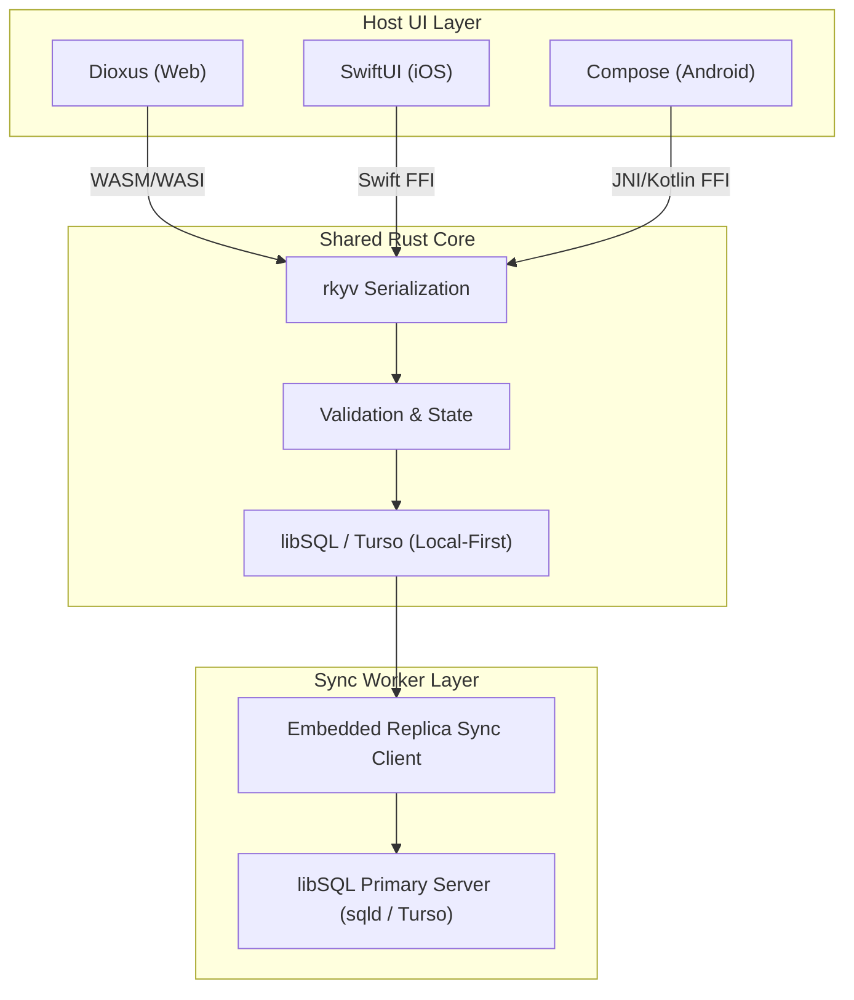

# Architectural Specification: Yntra Platform

This document specifies the technical design, data flows, and platform integration mechanics of the Yntra Platform's local-first architecture.

---

## 1. Tripartite System Design

---

## 2. Storage & Persistence Layer

Yntra standardizes on **libSQL** (the open-contribution engine behind Turso) as the unified storage engine. This architecture combines the sub-millisecond offline performance of SQLite with native replication and vector capabilities.

### Client-Side Execution (Embedded libSQL)
All database queries run in-process directly on the host device:
*   **Performance**: Queries are executed locally on disk or in memory without network latency.
*   **Web (libSQL WASM)**: Runs inside a Web Worker communicating with the browser's **Origin Private File System (OPFS)** for high-throughput persistence.
*   **Native (Desktop & Mobile)**: Compiles via static bindings using the Rust `libsql` client crate.

### Synchronization (Embedded Replicas)
Replication is managed natively by libSQL's sync protocol, eliminating custom sync servers:
*   **Connection URL**: The database is initialized locally with a file path (e.g. `file:local.db`).
*   **Replication Client**: The background thread syncs changes bidirectionally with a primary server (a self-hosted `sqld` instance or Turso's managed cloud) whenever network connection is available.
*   **Offline-First**: Reads and writes are always executed locally first. Write transactions are queued in the background replication journal and flushed when online.

### Semantic Storage (Vector Search)
*   **Vector Indexing**: libSQL provides native vector columns and vector distance calculations, enabling local AI agents to perform semantic lookups and RAG directly inside the database.

---

## 3. High-Performance FFI Boundary (Zero-Copy)

Crossing the boundary between the shared Rust core and the host language (JavaScript/WASM, Swift, or Kotlin) can introduce millisecond-scale latency if JSON serialization is used.
To prevent this, Yntra implements:
1.  **Zero-Copy Serialization (`rkyv` / FlatBuffers)**: Instead of parsing bytes into an intermediate object tree in memory, the host language reads direct memory references.
2.  **UniFFI Bridge**: UniFFI generates bindings for Swift and Kotlin, handling resource cleanup, thread synchronization, and panic-safety wrapper code.

---

## 4. Conflict Resolution (Hybrid Relational-CRDT)

To prevent data loss during offline sync across multiple devices, Yntra implements a **Hybrid Relational-CRDT model**:

*   **Structured Metadata (Relational)**: Fields like task status, assignees, and timestamps are stored in standard libSQL columns. Conflicts on these fields use Last-Write-Wins (LWW) or transaction-level validation inside `yntra-core`.
*   **Collaborative Data (CRDTs)**: High-concurrency fields (such as note bodies, chat messages, and document content) are stored as binary BLOBs containing **Conflict-Free Replicated Data Type (CRDT)** logs (using Automerge or Yjs).
*   **Merge Engine**: When libSQL syncs raw database rows, `yntra-core` intercepts updates to CRDT columns, running the CRDT merge engine in-memory. This guarantees that concurrent text edits merge deterministically without overwriting each other, even after days of offline work.
*   **Offline Resilience**: All operations are written to the local replica journal. Upon reconnection, the libSQL sync protocol flushes writes to the primary, where the CRDT merge engine reconciles the binary logs.
