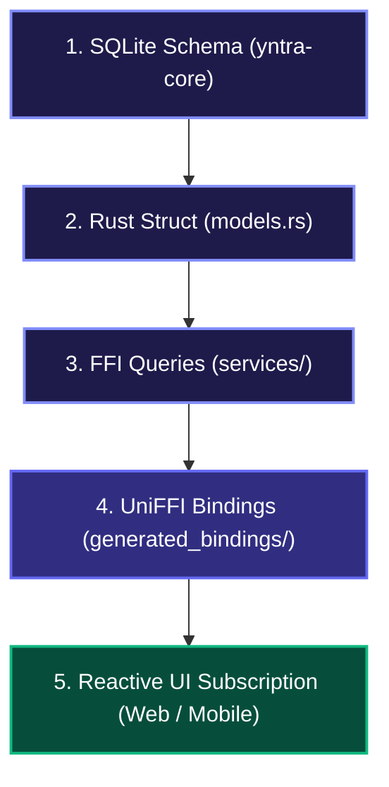

# Developer Guide: Adding a Functional Block or Service

This document describes the design patterns, FFI boundaries, and reactive bindings required to implement a new functional block or service within the Yntra Platform.

---

## 1. Development Lifecycle Overview

The Yntra Platform uses a **tripartite local-first architecture**. Adding a new feature follows a strict bottom-up data flow:



---

## 2. Step 1: Define Database Schema & Migrations

All tables are defined in [`yntra-core/src/database/schema/tables.rs`](file:///c:/Users/hellich/Desktop/YntraPlatform/yntra-core/src/database/schema/tables.rs) or added via incremental migration scripts in [`yntra-core/src/database/schema/migrations.rs`](file:///c:/Users/hellich/Desktop/YntraPlatform/yntra-core/src/database/schema/migrations.rs).

> [!IMPORTANT]
> To support local-first synchronization and multi-tenancy, every data table **MUST** include:
> * `workspace_id TEXT NOT NULL` — Supporting partitioning and tenant-level encryption.
> * `sync_status TEXT DEFAULT 'pending'` — Tracking local write mutations (`'pending'`, `'synced'`).
> * `updated_at INTEGER NOT NULL` — Unix millisecond timestamp tracking conflict resolution.

### SQLite Schema Blueprint:
```sql
CREATE TABLE IF NOT EXISTS inventory_items (
    id TEXT PRIMARY KEY NOT NULL,
    workspace_id TEXT NOT NULL,
    name TEXT NOT NULL,
    quantity INTEGER NOT NULL,
    updated_at INTEGER NOT NULL,
    sync_status TEXT DEFAULT 'pending' CHECK(sync_status IN ('pending', 'synced'))
);
```

---

## 3. Step 2: Declare the Rust Model

Define the data transfer object (DTO) in [`yntra-core/src/models.rs`](file:///c:/Users/hellich/Desktop/YntraPlatform/yntra-core/src/models.rs).

> [!TIP]
> Deriving `rkyv::Archive` enables zero-copy deserialization. The host application reads fields directly out of the raw memory buffer, dropping FFI boundary latency to nanoseconds.

### Model Blueprint:
```rust
use rkyv::{Archive, Deserialize, Serialize};

#[derive(uniffi::Record, Archive, Serialize, Deserialize, serde::Serialize, serde::Deserialize, Clone, Debug, PartialEq)]
#[rkyv(compare(PartialEq), derive(Debug))]
pub struct InventoryItem {
    pub id: String,
    pub workspace_id: String,
    pub name: String,
    pub quantity: i64,
    pub updated_at: i64,
    pub sync_status: String,
}
```

---

## 4. Step 3: Implement Database Services

Create a service module in `yntra-core/src/services/` (e.g., [`yntra-core/src/services/inventory.rs`](file:///c:/Users/hellich/Desktop/YntraPlatform/yntra-core/src/services/inventory.rs)).

> [!NOTE]
> Database access must go through the thread-safe pool manager. When executing writes, always trigger the observer notification so frontend layers re-render immediately.

### Service Blueprint:
```rust
use crate::database;
use crate::infra::observer::notify_observers;
use crate::{InventoryItem, YntraError};

#[uniffi::export]
pub async fn get_inventory_items(workspace_id: String) -> Result<Vec<InventoryItem>, YntraError> {
    let conn = database::acquire_connection().await?;
    let mut stmt = conn
        .prepare("SELECT id, workspace_id, name, quantity, updated_at, sync_status FROM inventory_items WHERE workspace_id = ?1")
        .await?;

    let items = stmt
        .query_map(crate::params![workspace_id], |row| {
            Ok(InventoryItem {
                id: row.get(0)?,
                workspace_id: row.get(1)?,
                name: row.get(2)?,
                quantity: row.get(3)?,
                updated_at: row.get(4)?,
                sync_status: row.get(5)?,
            })
        })
        .await?;

    Ok(items)
}

#[uniffi::export]
pub async fn save_inventory_item(item: InventoryItem) -> Result<(), YntraError> {
    let conn = database::acquire_connection().await?;
    let now = crate::infra::time::get_current_time_ms();

    conn.execute(
        "INSERT OR REPLACE INTO inventory_items (id, workspace_id, name, quantity, updated_at, sync_status) VALUES (?1, ?2, ?3, ?4, ?5, 'pending')",
        crate::params![&item.id, &item.workspace_id, &item.name, &item.quantity, now],
    )
    .await?;

    // Signal UI layers of database modifications
    notify_observers();
    Ok(())
}
```

Register the module and re-export FFI targets in [`yntra-core/src/lib.rs`](file:///c:/Users/hellich/Desktop/YntraPlatform/yntra-core/src/lib.rs):
```rust
pub mod services;
pub use services::inventory::*;
```

---

## 5. Step 4: Re-generate FFI Bindings

Use the bindings manager to rebuild the core, verify WASM target compliance, and output language bindings:
```bash
cargo run -p yntra-uniffi-bindgen
```

> [!WARNING]
> Ensure no thread-blocking code or native filesystem manipulation is introduced without appropriate WASM targets, otherwise WASM compilation checks will fail during binding generation.

---

## 6. Step 5: Implement UI Subscriptions (Reactive Observers)

To prevent lagging UIs, frontend code must **never poll** FFI boundary endpoints.

### Web & Desktop (Dioxus 0.7+)
Bind a signal to the SQLite bridge observer channel:

1. **Map Database Trigger to Resource** inside [`yntra-ui/src/state/resources.rs`](file:///c:/Users/hellich/Desktop/YntraPlatform/yntra-ui/src/state/resources.rs):
```rust
let inventory = use_resource(move || {
    let _trig = trigger_inventory.read(); // Subscribes to modifications
    async move {
        get_inventory_items("workspace-1".to_string()).await.unwrap_or_default()
    }
});
```

2. **Trigger Updates** in [`yntra-ui/src/state/mod.rs`](file:///c:/Users/hellich/Desktop/YntraPlatform/yntra-ui/src/state/mod.rs):
```rust
"inventory_items" => update_inventory = true,
```

---

### iOS Client (SwiftUI)
Register a `SwiftDbObserver` inside the ViewModel to handle reactive reloading:

```swift
import SwiftUI
import yntra_core

class InventoryViewModel: ObservableObject {
    @Published var items: [InventoryItem] = []
    private var observer: SwiftDbObserver?
    
    init() {
        loadItems()
        self.observer = SwiftDbObserver { [weak self] in
            self?.loadItems()
        }
        registerObserver(observer: self.observer!)
    }
    
    func loadItems() {
        Task {
            do {
                self.items = try await getInventoryItems(workspaceId: "workspace-1")
            } catch {
                print("Error loading inventory: \(error)")
            }
        }
    }
}
```

---

### Android Client (Jetpack Compose)
Initialize a `KotlinDbObserver` mapping database updates to StateFlow:

```kotlin
class InventoryViewModel : ViewModel() {
    private val _items = MutableStateFlow<List<InventoryItem>>(emptyList())
    val items: StateFlow<List<InventoryItem>> = _items
    
    private val observer = KotlinDbObserver {
        loadItems()
    }
    
    init {
        loadItems()
        registerObserver(observer)
    }
    
    fun loadItems() {
        viewModelScope.launch {
            _items.value = getInventoryItems(workspaceId = "workspace-1")
        }
    }
    
    override fun onCleared() {
        super.onCleared()
        clearObservers()
    }
}
```
