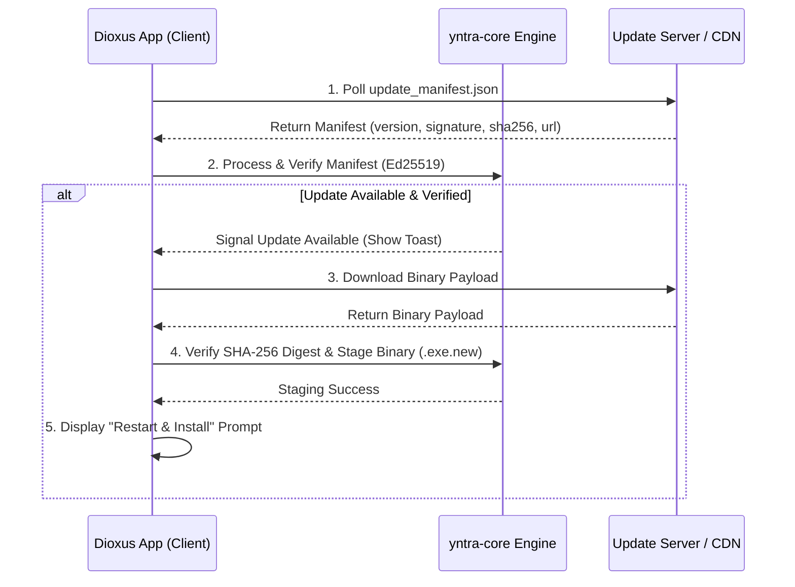

# In-App Auto-Updater Architecture

This document describes the in-app binary auto-update system for **Yntra Platform**, covering release feed verification, Ed25519 cryptographic signature checks, SHA-256 payload integrity validation, atomic executable replacement, and Dioxus UI notifications.

---

## 1. System Architecture



---

## 2. Cryptographic Security Model

Every binary release is cryptographically signed using **Ed25519** before distribution.

### Signature Message Envelope
The signed payload message is constructed canonically:
```text
"YNTRA_BINARY_UPDATE_V1\0" + len(version) + version + len(url) + url + len(sha256) + sha256
```

### Verification Rules
1. **Public Key Validation**: The client verifies the signature against `YNTRA_RELEASE_PUBLIC_KEY`.
2. **SHA-256 Integrity Check**: Before staging, the downloaded binary bytes are hashed; any byte corruption or mismatch aborts installation.
3. **Minimum Supported Version**: The manifest specifies `min_supported_version` to prevent invalid upgrade paths.

---

## 3. Platform Binary Replacement Strategies

* **Windows**: Running `.exe` files are locked by the operating system. The updater stages the verified payload as `yntra-ui.exe.new`. Upon user consent, a lightweight helper script swaps the binary on application exit (`move /Y yntra-ui.exe.new yntra-ui.exe`).
* **macOS / Linux**: Staged binaries replace the existing executable atomically (`std::fs::rename`).

---

## 4. Dioxus UI Component

The auto-updater integrates into the main application layout via `AutoUpdateToast`:
* **Location**: Mounted in `ToastProvider` in [`yntra-ui/src/main.rs`](file:///c:/Users/hellich/Desktop/YntraPlatform/yntra-ui/src/main.rs).
* **Component Path**: [`yntra-ui/src/components/auto_updater.rs`](file:///c:/Users/hellich/Desktop/YntraPlatform/yntra-ui/src/components/auto_updater.rs).
* **Features**: Dynamic download progress bar, release notes preview, "Remind Me Later", and "Restart & Install" triggers.
