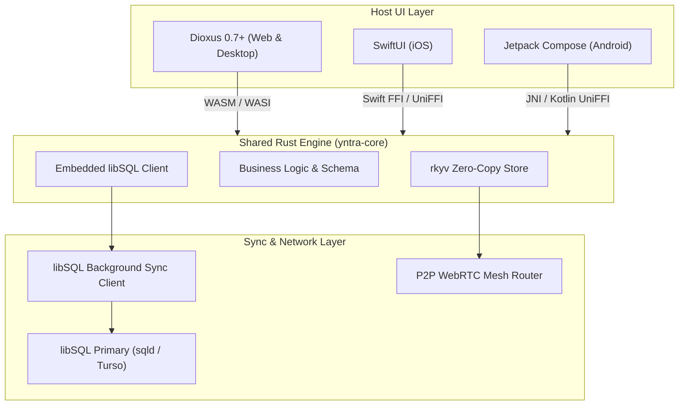

# Architecture Overview: Tripartite Local-First System

Yntra Platform implements a **Local-First Tripartite Architecture** engineered for sub-millisecond Time-To-Interactive (TTI) responsiveness across Web, Desktop, and Native Mobile.

---

## 1. System Topology

---

## 2. Core Architectural Principles

1. **Local-First Precedence**: Every user mutation is validated and written to local database replicas (`< 1ms`) before any network interaction takes place.
2. **Tripartite Separation**: UI clients (Dioxus, SwiftUI, Compose) act strictly as read-only projections of the local core state. UI components never query APIs directly.
3. **Reactive FFI Observers**: UI components subscribe to `DatabaseObserver` state notifications instead of polling.
4. **Zero-Copy & Versioned Memory Boundary**: Core Rust engine memory operations use `rkyv` zero-copy serialization with version-tagged binary envelopes. Crossing FFI into host UI layers (SwiftUI, Jetpack Compose, JS) materializes native language objects managed by host garbage collection / ARC.
5. **Resilient Network Fallbacks**: P2P WebRTC mesh transfers attempt direct ICE connection with a 3,000ms SLA before seamlessly degrading to TLS-encrypted TURN relay servers.

