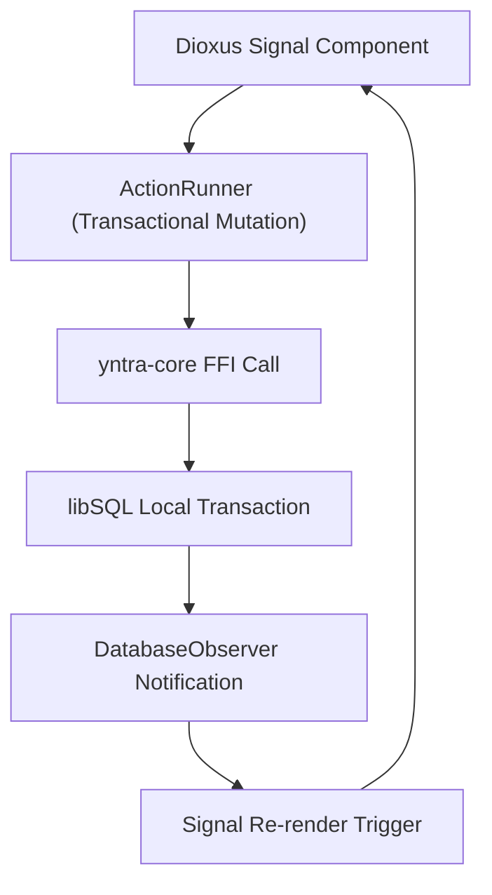

# Dioxus 0.7+ Signal State Management & ActionRunner Pattern

Yntra's frontend UI ([`yntra-ui/src/state/mod.rs`](file:///c:/Users/hellich/Desktop/YntraPlatform/yntra-ui/src/state/mod.rs)) implements Dioxus 0.7+ fine-grained reactive signals, centralized `AppState` signals, resource caching hooks, and the `ActionRunner` transactional UI mutation pattern.

---

## 1. System State Topology



---

## 2. Global `AppState` & Fine-Grained Signals

Dioxus 0.7 replaces legacy hooks (`use_state`, `use_ref`) with fine-grained `Signal<T>` primitives that track memory dependencies at runtime:

```rust
#[derive(Clone, Copy)]
pub struct AppState {
    pub active_workspace: Signal<Option<Workspace>>,
    pub active_user: Signal<Option<User>>,
    pub toasts: Signal<Vec<ToastAlert>>,
    pub is_offline: Signal<bool>,
}
```

* **Single Read Projection**: Components consume UI state as a read-only projection of `yntra-core`.
* **Scoped Re-renders**: Updating `toasts` re-renders only toast notification components without invalidating active workspace components.

---

## 3. The `ActionRunner` Pattern

To enforce error handling, toast alert feedback, and optimistic UI updates, all user actions execute through `ActionRunner`:

```rust
pub async fn run_action<F, T>(
    mut toasts: Signal<Vec<ToastAlert>>,
    action_name: &str,
    future: F,
) -> Option<T>
where
    F: std::future::Future<Output = Result<T, YntraError>>,
{
    match future.await {
        Ok(result) => {
            toasts.write().push(ToastAlert::success(action_name));
            Some(result)
        }
        Err(err) => {
            toasts.write().push(ToastAlert::error(&err.to_string()));
            None
        }
    }
}
```

### Benefits
* **Consistent Error Handling**: Automatically traps core `YntraError` results and displays user-facing toast alerts.
* **No Direct DB Calls**: Prevents UI components from performing raw SQL queries or bypassing business validation.
