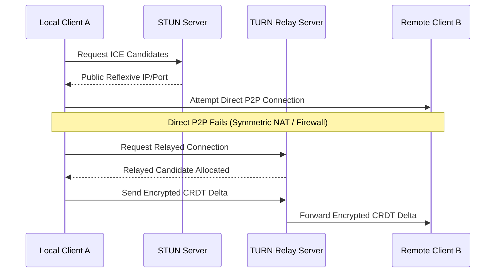

# CRDT & Peer-to-Peer (P2P) Mesh Sync

For high-concurrency collaborative editing (notes, field checklists, messaging) without a central cloud server, Yntra integrates **Loro / Automerge binary CRDTs** over WebRTC P2P mesh data channels.

---

## 1. Zero-Copy Store & CRDT Logs

Collab columns in libSQL store raw binary CRDT operation logs:

```rust
use yntra_core::{ZeroCopyNoteStore, P2PMeshSyncRouter};

// Write collaborative note update
let store = ZeroCopyNoteStore::new(workspace_id);
store.apply_binary_log(crdt_payload)?;
```

---

## 2. WebRTC Peer Mesh Router

When devices reside on the same local Wi-Fi or ad-hoc WebRTC mesh network, `P2PMeshSyncRouter` exchanges CRDT binary delta logs directly between peer nodes without contacting the central cloud database.

---

## 3. CRDT Log Compaction & Garbage Collection (GC) Policy

> [!IMPORTANT]
> Uncompacted CRDT operation logs can cause rapid SQLite storage bloat. `yntra-core` enforces automatic log compaction and GC snapshots.

### Compaction Thresholds & Rules
* **Operation Count Limit**: When a document's operation log exceeds **1,000 operations**, a full snapshot export is triggered.
* **Storage Footprint Limit**: If CRDT BLOB storage for a single document exceeds **5 MB**, `yntra-core` flushes state into a single compressed Loro snapshot BLOB and truncates historical delta logs.
* **Tombstone Pruning**: Deleted CRDT nodes and tombstones older than **30 days** are purged once all known peer devices have acknowledged the latest vector clock epoch.

---

## 4. WebRTC TURN Relay Fallback SLA & NAT Traversal

In enterprise environments with symmetric NATs, strict corporate firewalls, or mobile carrier CGNAT, direct P2P ICE candidate traversal can fail in **15–20% of sessions**.



### TURN Fallback SLA Guarantees
1. **ICE Candidate Timeout**: If direct P2P connectivity is not established within **3,000ms**, `P2PMeshSyncRouter` automatically switches to secure TLS-encrypted TURN relay servers.
2. **End-to-End Encryption (E2EE)**: All CRDT delta payloads routed via TURN servers are encrypted client-side via Noise Protocol / ChaCha20-Poly1305, ensuring TURN server operators cannot view payload contents.

