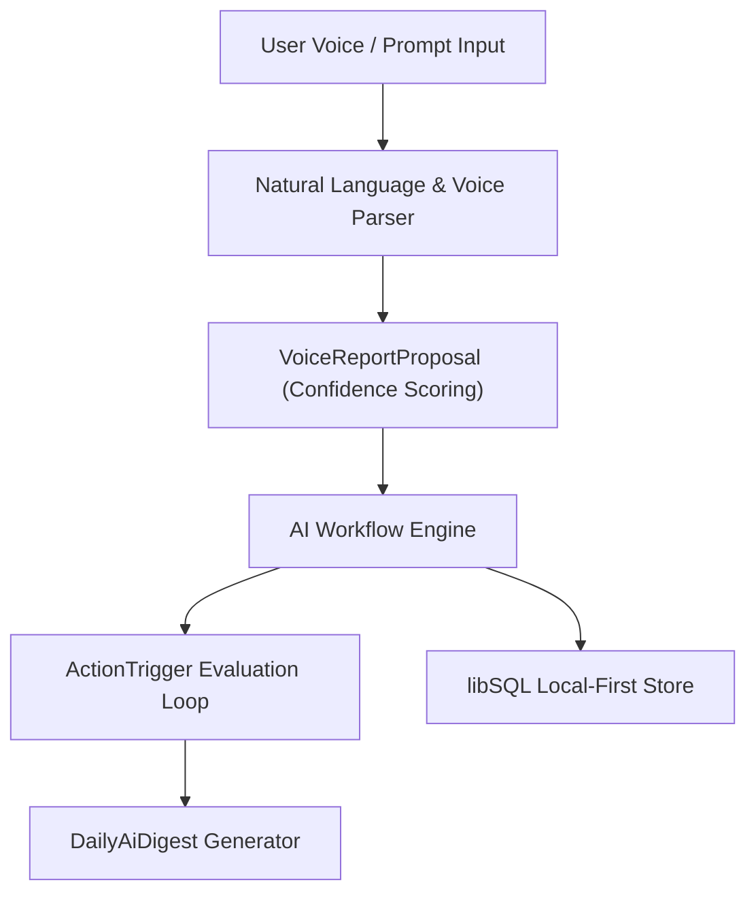

# AI Automation Engine & Autonomous Agent Workflows

Yntra Platform incorporates an **AI Automation Engine** ([`yntra-core/src/services/ai_automation.rs`](file:///c:/Users/hellich/Desktop/YntraPlatform/yntra-core/src/services/ai_automation.rs)) designed for natural language task execution, voice-to-structured report conversion, automated workflow triggers, and daily executive digests.

---

## 1. System Architecture



---

## 2. Voice-to-Report Proposals

Voice recordings and natural language audio inputs are processed into structured time and field report proposals:

```rust
pub struct VoiceReportProposal {
    pub hours: f64,
    pub date: String,
    pub note: String,
    pub category: String,
    pub requires_approval: bool,
    pub confidence_score: f64,
    pub language_detected: String,
}
```

* **Confidence Scoring**: If `confidence_score < 0.85`, `requires_approval` is automatically set to `true`, prompting the user for manual confirmation in the UI.
* **Multilingual Detection**: Automatically detects Nordic languages (`sv-SE`, `no-NO`, `da-DK`, `fi-FI`) and maps spoken categories to workspace project codes.

---

## 3. Natural Language Action Triggers

Users can configure event-driven automation rules in plain text via `ActionTrigger`:

```rust
pub struct ActionTrigger {
    pub id: String,
    pub workspace_id: String,
    pub created_by: String,
    pub natural_language_prompt: String,
    pub condition_type: String,
    pub condition_params: String,
    pub action_type: String,
    pub action_params: String,
    pub is_active: bool,
    pub created_at: i64,
}
```

### Trigger Evaluation Loop
* **Event Listening**: Listens to local `DatabaseObserver` events (e.g. new invoice created, job status changed to completed).
* **Condition Matching**: Evaluates `condition_type` against incoming state mutations.
* **Automated Execution**: Dispatches notification emails, webhook web calls, or auto-generates follow-up tasks without manual intervention.

---

## 4. Executive Daily Digests

`DailyAiDigest` aggregates workspace activity across time logs, job completions, and revenue shifts into concise summaries generated every 24 hours.
