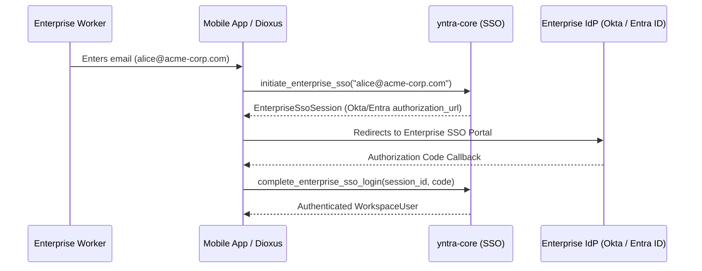

# Enterprise SSO: OIDC & SAML 2.0 Integration

Yntra Platform supports enterprise **Single Sign-On (SSO)** connecting to identity providers like **Okta**, **Microsoft Entra ID (Azure AD)**, and **Ping Identity**.

---

## 1. Domain Auto-Detection Flow

---

## 2. Configuration Parameters

Enterprise domains register OIDC client credentials via `initiate_enterprise_sso()`.
When a user enters an enterprise email domain (e.g. `@acme-corp.com`), Yntra automatically resolves the domain mapping and redirects to the enterprise authorization endpoint.
