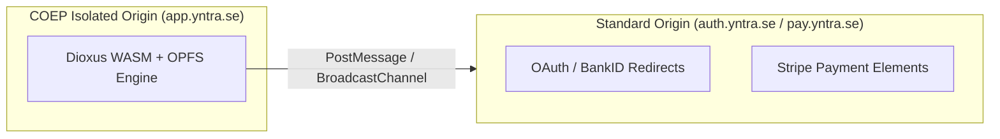

# Web WASM OPFS Infrastructure & Browser Deployment Guide

This guide details the technical requirements, HTTP headers, and browser storage quirks for deploying **Dioxus WASM + libSQL OPFS** to production CDNs (Cloudflare Pages, Vercel, Netlify, AWS CloudFront).

---

## 1. Required Cross-Origin HTTP Response Headers

To enable `SharedArrayBuffer` and high-performance Web Worker threading for libSQL OPFS file locks, production web servers **must** return the following HTTP response headers:

```http
Cross-Origin-Opener-Policy: same-origin
Cross-Origin-Embedder-Policy: require-corp
```

### Cloudflare Pages Configuration (`_headers` file)
Place a `_headers` file inside your build output root (`dist/_headers`):

```http
/*
  Cross-Origin-Opener-Policy: same-origin
  Cross-Origin-Embedder-Policy: require-corp
  Cache-Control: public, max-age=3600
```

---

## 2. Browser Storage Quotas & Safari OPFS Fallbacks

### Storage Quotas by Browser Engine

| Browser | Storage Quota | Eviction Risk | Notes |
| :--- | :--- | :--- | :--- |
| **Chromium** | ~80% of available disk space | Low (Persistent) | Best WASM OPFS performance |
| **Firefox** | ~50% of available disk space | Low | Supports OPFS sync handles |
| **Safari / iOS** | ~1 GB soft limit per origin | Medium | Prompts user if quota exceeded |

### Safari OPFS Fallback Protocol
Safari iOS enforces strict origin storage quotas. `yntra-core` monitors OPFS storage quotas via `navigator.storage.estimate()` and flushes transaction logs to libSQL primary servers before quota limits are reached.

---

## 3. Dual-Domain Strategy for COEP Third-Party Embeds

> [!NOTE]
> Requiring `Cross-Origin-Embedder-Policy: require-corp` isolates the main application origin (`app.yntra.se`) for `SharedArrayBuffer` & OPFS. However, third-party embeds (Stripe iFrames, OAuth login popups, external media CDNs) lacking `Cross-Origin-Resource-Policy: cross-origin` headers will be blocked by the browser.

### Architecture Routing Strategy


1. **Main Workspace Origin (`app.yntra.se`)**: Enforces COOP/COEP headers to run `SharedArrayBuffer` + OPFS.
2. **Third-Party Modal Subdomains (`auth.yntra.se`, `pay.yntra.se`)**: Served without COEP restriction to host Stripe payment elements and OAuth popups. Communication with the main application is bridged using `window.postMessage` or `BroadcastChannel`.

